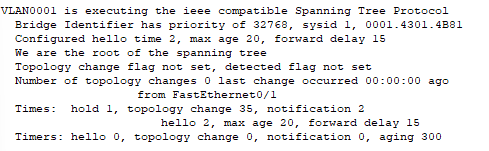
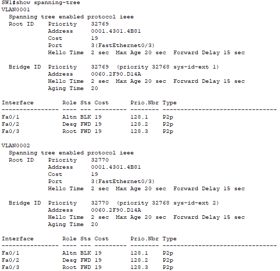
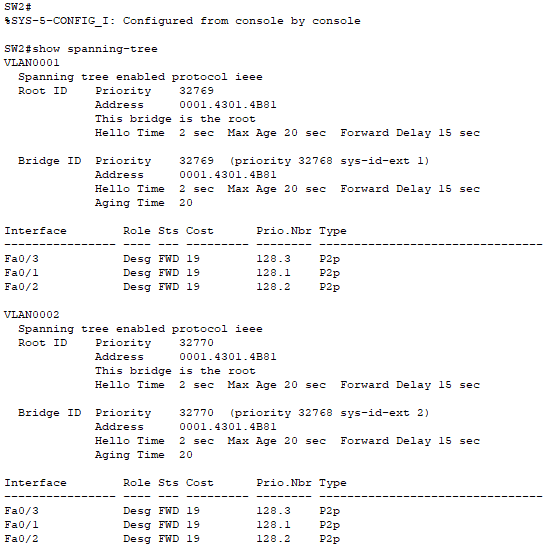
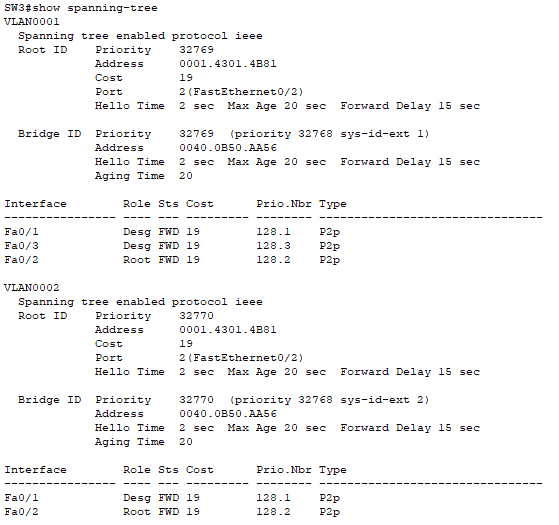
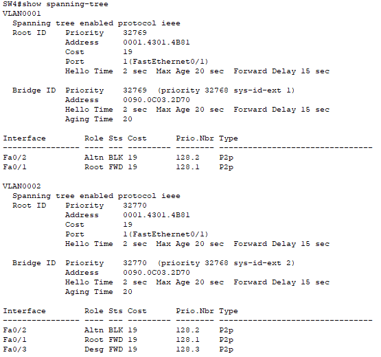
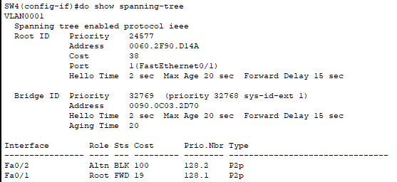
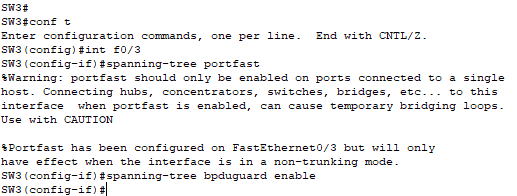
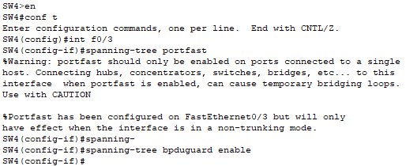

# Lab 21 — Configuring Spanning Tree Protocol (STP)

**Platform:** Cisco Packet Tracer  
**Source:** Jeremy's IT Lab — Day 21  
**Category:** Network / Switching  
**Difficulty:** Intermediate

---

## 🎯 Objective

Analyse and manipulate Spanning Tree Protocol (STP) behaviour across a four-switch topology. This lab covers root bridge election, port role/state identification, cost and priority manipulation, and configuring access-layer security features PortFast and BPDU Guard.

---

## 🖧 Topology Overview

A four-switch topology (SW1, SW2, SW3, SW4) interconnected via FastEthernet interfaces, running IEEE 802.1D STP across **VLAN 1** and **VLAN 2**.

| Switch | MAC Address     | Initial Role     |
|--------|-----------------|------------------|
| SW1    | 0060.2F90.D14A  | Non-root         |
| SW2    | 0001.4301.4B81  | **Root Bridge**  |
| SW3    | 0040.0B50.AA56  | Non-root         |
| SW4    | 0090.0C03.2D70  | Non-root         |

---

## 🔧 Lab Tasks

---

### Task 1 — Check the current STP topology. What is the root bridge? What is the STP role/state of each port on each switch?

**Commands used:**
```
# show spanning-tree
# show spanning-tree detail
```

**Root Bridge: SW2**

SW2 won the root election because it held the lowest MAC address (`0001.4301.4B81`) across all switches with equal bridge priority (32769). This was confirmed via `show spanning-tree detail`, which output: *"We are the root of the spanning tree."*



**SW1 — VLAN 1 & 2:**

| Interface | Role       | State      | Cost |
|-----------|------------|------------|------|
| Fa0/1     | Alternate  | Blocking   | 19   |
| Fa0/2     | Designated | Forwarding | 19   |
| Fa0/3     | Root       | Forwarding | 19   |



**SW2 — VLAN 1 & 2 (Root Bridge):**

| Interface | Role       | State      | Cost |
|-----------|------------|------------|------|
| Fa0/1     | Designated | Forwarding | 19   |
| Fa0/2     | Designated | Forwarding | 19   |
| Fa0/3     | Designated | Forwarding | 19   |

> All ports on the root bridge are Designated/Forwarding — the root bridge never has a root port.



**SW3 — VLAN 1:**

| Interface | Role       | State      | Cost |
|-----------|------------|------------|------|
| Fa0/1     | Designated | Forwarding | 19   |
| Fa0/2     | Root       | Forwarding | 19   |
| Fa0/3     | Designated | Forwarding | 19   |



**SW4 — VLAN 1:**

| Interface | Role      | State      | Cost |
|-----------|-----------|------------|------|
| Fa0/1     | Root      | Forwarding | 19   |
| Fa0/2     | Alternate | Blocking   | 19   |



> A cost of 19 is the standard STP cost for FastEthernet (100 Mbps). Each non-root switch selects the port with the lowest-cost path to the root bridge as its root port.

---

### Task 2 — Configure SW1 as primary root for VLAN 1 and secondary for VLAN 2. Configure SW2 as primary root for VLAN 2 and secondary for VLAN 1. What is the STP role/state of each port on each switch now?

**SW1 configuration:**
```
SW1(config)# spanning-tree vlan 1 root primary
SW1(config)# spanning-tree vlan 2 root secondary
```

**SW2 configuration:**
```
SW2(config)# spanning-tree vlan 2 root primary
SW2(config)# spanning-tree vlan 1 root secondary
```

This introduces **Per-VLAN Spanning Tree (PVST+)**, allowing a different root bridge per VLAN — enabling traffic load balancing across the topology.

**SW1 — Post-configuration:**

| Interface | VLAN 1           | VLAN 2           |
|-----------|------------------|------------------|
| Fa0/1     | Designated / FWD | Designated / FWD |
| Fa0/2     | Designated / FWD | Designated / FWD |
| Fa0/3     | Designated / FWD | Root / FWD       |

> SW1 is now root for VLAN 1, so all its VLAN 1 ports become Designated. For VLAN 2 it is secondary, so Fa0/3 becomes its root port toward SW2.

**SW2 — Post-configuration:**

| Interface | VLAN 1           | VLAN 2           |
|-----------|------------------|------------------|
| Fa0/1     | Designated / FWD | Designated / FWD |
| Fa0/2     | Designated / FWD | Designated / FWD |
| Fa0/3     | Root / FWD       | Designated / FWD |

> SW2 is now root for VLAN 2 (all Designated), and secondary for VLAN 1 — Fa0/3 becomes its root port toward SW1.

---

### Task 3 — Increase the VLAN 1 cost of SW4's Fa0/2 to 100. Does SW4 select a different root port? Why/why not?

**Configuration:**
```
SW4(config)# interface fa0/2
SW4(config-if)# spanning-tree vlan 1 cost 100
```

**SW4 VLAN 1 — before and after:**

| Interface | Before               | After                |
|-----------|----------------------|----------------------|
| Fa0/1     | Alternate / Blocking | Root / Forwarding    |
| Fa0/2     | Root / Forwarding    | Alternate / Blocking |



**Yes — SW4 selected a different root port.**

STP selects the root port based on the lowest path cost to the root bridge. Raising Fa0/2's cost from 19 to 100 made it the more expensive path, so STP recalculated and elected Fa0/1 (still at cost 19) as the new root port.

---

### Task 4 — Increase the VLAN 1 port priority of SW1's Fa0/1 to 240. Does SW3 select a different root port? Why/why not?

**Configuration:**
```
SW1(config)# interface fa0/1
SW1(config-if)# spanning-tree vlan 1 port-priority 240
```

**SW3 VLAN 1 — before and after:**

| Interface | Before                    | After                     |
|-----------|---------------------------|---------------------------|
| Fa0/1     | Root / Forwarding         | Root / Forwarding         |
| Fa0/2     | Non-Designated / Blocking | Non-Designated / Blocking |
| Fa0/3     | Designated / Forwarding   | Designated / Forwarding   |

**No — SW3 did not select a different root port.**

Port priority is only evaluated as a tiebreaker when path cost and upstream bridge ID are equal. Since Fa0/1 was already the lowest-cost path to the root bridge for SW3, STP decision-making never reached the tiebreaker stage. The priority change had no practical effect in this topology.

---

### Task 5 — Configure PortFast and BPDU Guard on the Fa0/3 interfaces of SW3 and SW4

**SW3:**
```
SW3(config)# interface fa0/3
SW3(config-if)# spanning-tree portfast
SW3(config-if)# spanning-tree bpduguard enable
```



**SW4:**
```
SW4(config)# interface fa0/3
SW4(config-if)# spanning-tree portfast
SW4(config-if)# spanning-tree bpduguard enable
```



Both switches returned the expected Packet Tracer warning upon enabling PortFast:

> *"PortFast should only be enabled on ports connected to a single host. Connecting hubs, concentrators, switches, bridges, etc. to this interface when PortFast is enabled can cause temporary bridging loops. Use with CAUTION."*

This warning is expected and does not prevent configuration — it is a reminder that PortFast is only appropriate on access ports facing end hosts, not other switches.

| Feature        | Purpose |
|----------------|---------|
| **PortFast**   | Bypasses STP Listening and Learning states, allowing an access port to reach Forwarding immediately. Intended for end-host ports only. |
| **BPDU Guard** | Err-disables the port if a BPDU is received, protecting against unauthorised switches being connected to access ports. |

---

## ✅ Verification Summary

| Task | Verified Via |
|------|-------------|
| Root bridge identification | `show spanning-tree detail` — confirmed "We are the root" on SW2 |
| Port role/state mapping | `show spanning-tree` per switch per VLAN |
| Cost manipulation (Task 3) | `show spanning-tree` on SW4 — Fa0/2 shifted to BLK, Fa0/1 to FWD |
| Priority tiebreaker (Task 4) | No change on SW3 — confirmed priority only applies when cost is equal |
| PortFast / BPDU Guard | CLI warning and configuration output confirmed on both SW3 and SW4 |

---

## 📚 Key Concepts Demonstrated

| Concept | Description |
|---------|-------------|
| **Root Bridge Election** | Lowest bridge priority wins; MAC address is the tiebreaker |
| **PVST+** | Per-VLAN STP allows different root bridges per VLAN for load balancing |
| **Port Roles** | Root, Designated, Alternate — determined by cost and bridge ID |
| **Port States** | Forwarding, Blocking — result of role assignment |
| **STP Cost** | Path metric based on interface bandwidth; FastEthernet = 19 |
| **Port Priority** | Last-resort tiebreaker in root port selection |
| **PortFast** | Skips STP convergence delays on access ports facing end hosts |
| **BPDU Guard** | Err-disables port on BPDU receipt; prevents rogue switch attacks |

---

## 💡 Reflection

Task 4 was the most instructive — the port priority change had no visible effect because STP never reached the tiebreaker stage. It demonstrated that STP follows a strict decision hierarchy: path cost is evaluated before port priority, meaning manipulating priority is a no-op unless costs are already equal. Task 3 was the cleaner demonstration of topology manipulation — raising the cost directly and immediately shifted SW4's root port, with results visible in `show spanning-tree`.

---

*Lab file: `Day_21_Lab_-_Configuring_Spanning_Tree_1_.pkt`*  
*Jeremy's IT Lab — Day 21 | Cert IV in Cyber Security*
