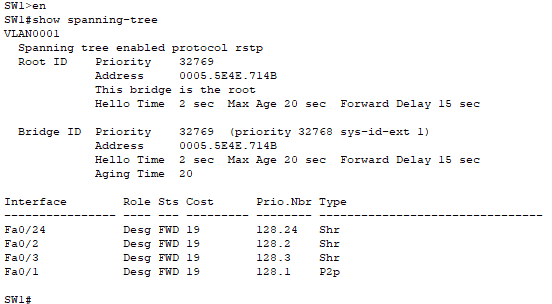
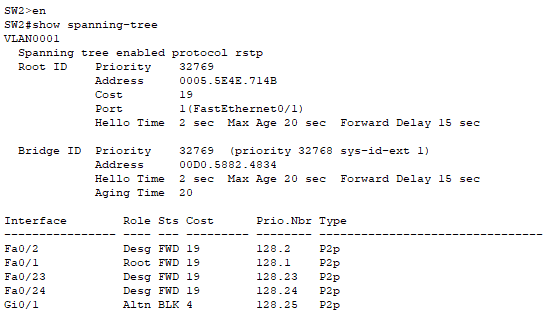
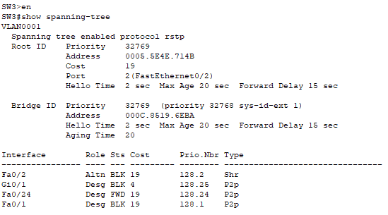
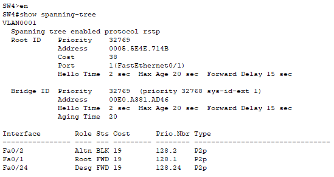

# Lab 22 - Rapid Spanning Tree Protocol (RSTP)

**Platform:** Cisco Packet Tracer  
**Source:** Jeremy's IT Lab - Day 22  
**Category:** Network / Switching  
**Difficulty:** Intermediate

---

## Objective

Analyse and configure Rapid Spanning Tree Protocol (RSTP) across a four-switch topology. This lab covers root bridge identification, port role and state analysis, manual RSTP link type configuration, and understanding how hubs affect RSTP behaviour.

---

## Topology Overview

A four-switch topology (SW1, SW2, SW3, SW4) running RSTP (802.1w). The topology includes both point-to-point switch connections and shared hub connections, which affect port role assignment.

| Switch | MAC Address    | Initial Role    |
|--------|----------------|-----------------|
| SW1    | 0005.5E4E.714B | **Root Bridge** |
| SW2    | 00D0.5882.4834 | Non-root        |
| SW3    | 000C.8519.6EBA | Non-root        |
| SW4    | 00E0.A381.AD46 | Non-root        |

---

## Packet Tracer Limitations Noted

Two known issues were encountered during this lab that are specific to Packet Tracer and not errors within the configuration:

- **Incorrect RSTP port costs** - Packet Tracer displays classic STP costs (e.g. 19 for FastEthernet) instead of the correct RSTP costs. However, this does not affect the logic of the lab.
- **SW1 F0/3 Backup port not displayed** - F0/3 should appear as a Backup port since it connects to the same hub as F0/2. Packet Tracer does not display this correctly. The correct role has been determined based on RSTP rules and confirmed via the lab demonstration.
- **SW3 port roles incorrect in CLI** - As noted by Jeremy's IT Lab, SW3's port roles are not displayed correctly in Packet Tracer. The correct roles have been determined manually and confirmed via the demonstration video.

---

## Lab Tasks

---

### Task 1 - Which switch is the root bridge? Use the CLI to examine the port role/state of each interface on the root. What appears different than what you have learned about the root bridge? What is the cause of this?

**Commands used:**
```
# show spanning-tree
```

**Root Bridge: SW1**

SW1 won the root election as it held the lowest MAC address (`0005.5E4E.714B`) across all switches with equal bridge priority (32769). This was confirmed using `show spanning-tree`, which output: *"This bridge is the root."*



**SW1 - VLAN 1:**

| Interface | Role       | State      | Expected Role (RSTP)  |
|-----------|------------|------------|-----------------------|
| Fa0/1     | Designated | Forwarding | Designated            |
| Fa0/2     | Designated | Forwarding | Designated            |
| Fa0/3     | Designated | Forwarding | **Backup** (see note) |
| Fa0/24    | Designated | Forwarding | Designated            |

**What appears different?**

Nothing at first, however as stated previously, there is a bug within Packet Tracer which doesn't display the correct roles. After reviewing with Jeremy's demonstration, it seems that f0/3 is meant to be a backup port, as it is connected to the same hub as f0/2, but is displaying incorrectly.
Throughout my learning I had expected that all ports out of a root port would be in a designated role. Although, when 2 ports are connected to the same hub, it seems it overwrites that rule.

**What is the cause?**

Fa0/2 and Fa0/3 on SW1 are both connected to the same hub. In RSTP, when two ports on the same switch connect to the same shared segment, one must be blocked to prevent a loop. The port with the higher port ID is blocked, in this case Fa0/3, giving it a Backup role. The Backup role is exclusive to RSTP and is not in classic STP.


---

### Task 2 - Without using the CLI, determine the port role/state of each remaining switch interface. Use the CLI to confirm.

Port roles were determined manually by working through root cost, bridge ID, and port ID tiebreakers before using the CLI to verify.

**SW2:**

| Interface | Role       | State      |
|-----------|------------|------------|
| Fa0/1     | Root       | Forwarding |
| Fa0/2     | Designated | Forwarding |
| Fa0/23    | Designated | Forwarding |
| Fa0/24    | Designated | Forwarding |
| Gi0/1     | Alternate  | Blocking   |



**SW3:**

| Interface | Role       | State      |
|-----------|------------|------------|
| Fa0/1     | Designated | Forwarding |
| Fa0/2     | Root       | Forwarding |
| Fa0/24    | Designated | Forwarding |
| Gi0/1     | Designated | Forwarding |



**SW4:**

| Interface | Role       | State      |
|-----------|------------|------------|
| Fa0/1     | Root       | Forwarding |
| Fa0/2     | Alternate  | Blocking   |
| Fa0/24    | Designated | Forwarding |



**Tiebreaker decisions:**

- **SW4 root port** - SW4 had a tie in root cost with both SW2 and SW3. SW3 has the lower bridge ID due to its lower MAC address, so SW4's Fa0/1 toward SW3 becomes the root port.
- **SW2 vs SW3 on Gi0/1** - Both have equal root cost. SW3 has the lower bridge ID, so SW3's Gi0/1 becomes Designated and SW2's Gi0/1 becomes Alternate.
- **SW2 Fa0/2 vs SW4 Fa0/2** - SW2 has the cheaper root cost, so SW2's Fa0/2 becomes Designated and SW4's Fa0/2 becomes Alternate.

---

### Task 3 - Manually configure the appropriate RSTP link type on each interface. What do you think is the correct link type for SW1's F0/24?

**SW1:**

| Interface | Link Type         |
|-----------|-------------------|
| Fa0/1     | Point-to-point    |
| Fa0/2     | Shared            |
| Fa0/3     | Shared            |
| Fa0/24    | Shared + Edge     |

```
SW1(config)# interface fa0/1
SW1(config-if)# spanning-tree link-type point-to-point

SW1(config)# interface fa0/2
SW1(config-if)# spanning-tree link-type shared

SW1(config)# interface fa0/3
SW1(config-if)# spanning-tree link-type shared

SW1(config)# interface fa0/24
SW1(config-if)# spanning-tree link-type shared
SW1(config-if)# spanning-tree portfast
```
I initially got this wrong, as I assumed F0/24 only needed to be shared, as it connects to a hub. However after reviewing with the demonstration it also requires PortFast as there are end hosts at the other end of the hub.

**SW1's F0/24** connects to a hub that has end hosts on the other side. It needs to be configured as both shared (due to the hub) and edge/PortFast (due to the end hosts). Packet Tracer does not display this combination correctly in the CLI, but both commands are applied.


**SW2:**

| Interface | Link Type      |
|-----------|----------------|
| Fa0/1     | Point-to-point |
| Fa0/2     | Point-to-point |
| Fa0/23    | Edge           |
| Fa0/24    | Edge           |
| Gi0/1     | Point-to-point |

```
SW2(config)# interface fa0/1
SW2(config-if)# spanning-tree link-type point-to-point

SW2(config)# interface fa0/2
SW2(config-if)# spanning-tree link-type point-to-point

SW2(config)# interface fa0/23
SW2(config-if)# spanning-tree portfast

SW2(config)# interface fa0/24
SW2(config-if)# spanning-tree portfast

SW2(config)# interface gi0/1
SW2(config-if)# spanning-tree link-type point-to-point
```

**SW3:**

| Interface | Link Type      |
|-----------|----------------|
| Fa0/1     | Point-to-point |
| Fa0/2     | Shared         |
| Fa0/24    | Edge           |
| Gi0/1     | Point-to-point |

```
SW3(config)# interface fa0/1
SW3(config-if)# spanning-tree link-type point-to-point

SW3(config)# interface fa0/2
SW3(config-if)# spanning-tree link-type shared

SW3(config)# interface fa0/24
SW3(config-if)# spanning-tree portfast

SW3(config)# interface gi0/1
SW3(config-if)# spanning-tree link-type point-to-point
```

**SW4:**

| Interface | Link Type      |
|-----------|----------------|
| Fa0/1     | Point-to-point |
| Fa0/2     | Point-to-point |
| Fa0/24    | Edge           |

```
SW4(config)# interface range fa0/1-2
SW4(config-if-range)# spanning-tree link-type point-to-point

SW4(config)# interface fa0/24
SW4(config-if)# spanning-tree portfast
```

> I remembered you could configure a range of interfaces together with the `interface range` command. This is useful for batch commands across multiple interfaces.

---

## Verification Summary

| Task | Verified Via |
|------|-------------|
| Root bridge identification | `show spanning-tree` - confirmed "This bridge is the root" on SW1 |
| Port role/state mapping | `show spanning-tree` per switch, cross-referenced against manual calculations |
| Packet Tracer errors | Cross-referenced against Jeremy's IT Lab demonstration video |
| Link type configuration | Commands applied per interface and confirmed in CLI output |

---

## Key Concepts Demonstrated

| Concept | Description |
|---------|-------------|
| **RSTP (802.1w)** | Faster network adaptation than classic STP through new port roles and link types |
| **Backup Port** | RSTP-only role, a discarding port on a switch with multiple connections to the same hub |
| **Alternate Port** | RSTP equivalent of a blocked non-designated port, provides a backup path to the root |
| **Point-to-point Link** | Full-duplex connection between two switches |
| **Shared Link** | Connection to a hub, half-duplex |
| **Edge Port (PortFast)** | Port connected to an end host skips STP transition states entirely |
| **Tiebreaker Hierarchy** | Root cost then bridge ID then port ID, applied in order when selecting root and designated ports |

---

## Reflection

The most challenging part of this lab was working through the tiebreaker decisions manually before touching the CLI, particularly for SW4's root port and the SW2/SW3 Gi0/1 dispute. The Packet Tracer errors also added difficulty and confusion since the CLI could not always be trusted to confirm answers, requiring reviewing with the lab demonstration. SW1's F0/24 was also a new aspect, needing both link types applied together. Something Packet Tracer cannot display unfortunately, but important to understand.

---

*Lab file: `Day_22_Lab_-_Rapid_STP.pkt`*  
*Jeremy's IT Lab - Day 22 | Cert IV in Cyber Security*
