# Lab 23 - EtherChannel

**Platform:** Cisco Packet Tracer  
**Source:** Jeremy's IT Lab - Day 23  
**Category:** Network / Switching  
**Difficulty:** Intermediate

---

## Objective

Configure and verify EtherChannel across a multi-switch topology. This lab covers Layer 2 EtherChannel using LACP and PAgP, Layer 3 EtherChannel using static configuration, IP routing between subnets and EtherChannel load-balancing methods.

*Note: End host and SVI IP addresses are pre-configured.*

---

## Topology Overview

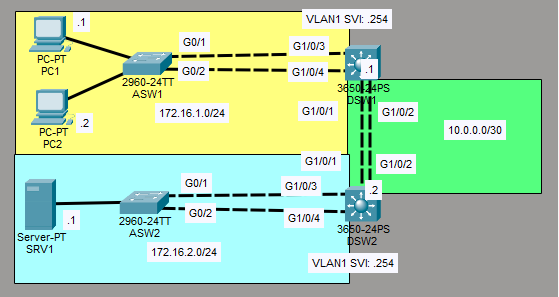

A four-switch topology consisting of two access switches (ASW1, ASW2) and two distribution switches (DSW1, DSW2).

| Switch | EtherChannel Role |
|--------|-------------------|
| ASW1   | Layer 2 LACP toward DSW1 |
| DSW1   | Layer 2 LACP toward ASW1 / Layer 3 Static toward DSW2 |
| ASW2   | Layer 2 PAgP toward DSW2 |
| DSW2   | Layer 2 PAgP toward ASW2 / Layer 3 Static toward DSW1 |

---

## Lab Tasks

---

### Task 1 - Configure Layer 2 EtherChannel between ASW1 and DSW1 using LACP. Configure it as a trunk.

LACP (Link Aggregation Control Protocol) is the industry standard protocol for negotiating EtherChannel (IEEE 802.3ad).
In my configuration, one side is set to active (initiates negotiation) and the other to passive (responds to negotiation). Active and passive can form an EtherChannel together as they are both LACP modes.

**ASW1:**

```
ASW1(config)# interface range g0/1 - 2
ASW1(config-if-range)# channel-group 1 mode active
```

The `interface range` command configures both interfaces together at once. Setting the mode to active means ASW1 will initiate LACP negotiation.
Port-channel 1 is created automatically using these commands.

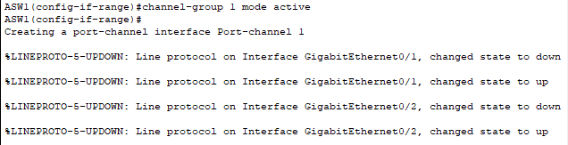

```
ASW1(config-if-range)# int port-channel 1
ASW1(config-if)# switchport mode trunk
```

Entering the port-channel interface and setting it to trunk mode applies trunking across both physical links in the EtherChannel.

**DSW1:**

```
DSW1(config)# int range g1/0/3 - 4
DSW1(config-if-range)# channel-group 2 mode passive
```

DSW1 is set to passive, meaning it will respond to LACP negotiation from ASW1 but not initiate it. Port-channel 2 changes to up automatically once it receives the connection from ASW1.

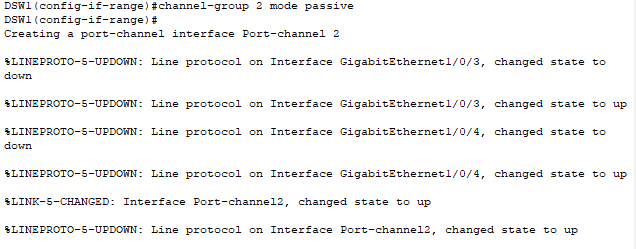

```
DSW1(config-if-range)# int port-channel 2
DSW1(config-if)# switchport mode trunk
```


**Verification:**

**ASW1:**

```
ASW1(config-if)# do show etherchannel summary
```

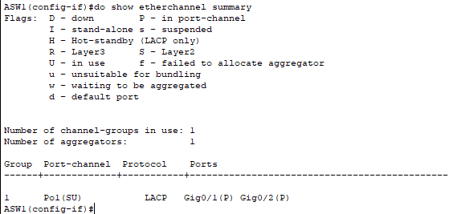

Port-channel 1 shows as (SU) confirming it is in use and Layer 2. Both G0/1 and G0/2 show as (P), confirming they are active members of the channel. The Protocol column confirms that it's using LACP.

```
ASW1(config-if)# do show interfaces trunk
```

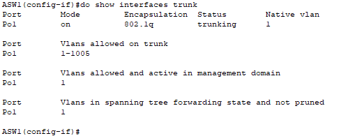

Po1 (port-channel 1) confirmed trunking.

**DSW1:**

```
DSW1(config-if)# do show etherchannel summary
```

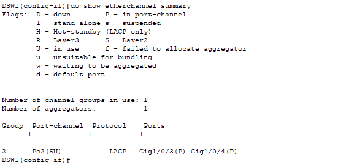

Port-channel 2 is confirmed to be active with correct ports and LACP protocol.

```
DSW1(config-if)# do show interfaces trunk
```

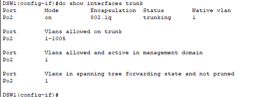

Po2 confirmed to be trunking.

---

### Task 2 - Configure Layer 2 EtherChannel between ASW2 and DSW2 using PAgP. Configure it as a trunk.

PAgP (Port Aggregation Protocol) is a Cisco proprietary protocol (Cisco exclusive) for negotiating EtherChannel. Desirable initiates negotiation and auto responds to it. Desirable and auto can form an EtherChannel together.

**ASW2:**

```
ASW2(config)# int range g0/1 - 2
ASW2(config-if-range)# channel-group 1 mode desirable
ASW2(config-if-range)# int port-channel 1
ASW2(config-if)# switchport mode trunk
```

ASW2 is set to desirable, meaning it will actively initiate PAgP negotiation.

**DSW2:**

```
DSW2(config)# int range g1/0/3 - 4
DSW2(config-if-range)# channel-group 2 mode auto
DSW2(config-if-range)# int port-channel 2
DSW2(config-if)# switchport mode trunk
```

DSW2 is set to auto, meaning it will respond to PAgP negotiation from ASW2 but not initiate it.

**Verification:**

**ASW2:**

```
ASW2(config-if)# do show etherchannel summary
```

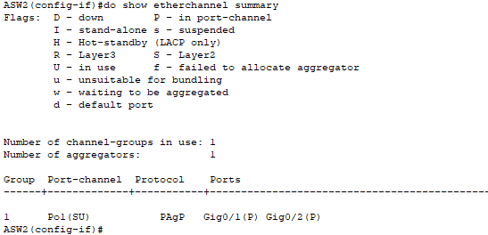

Port-channel 1 confirmed to be active with correct ports and PAgP protocol.

```
ASW2(config-if)# do show interfaces trunk
```

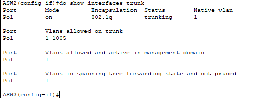

Po1 confirmed to be trunking.

**DSW2:**

```
DSW2(config-if)# do show etherchannel summary
```

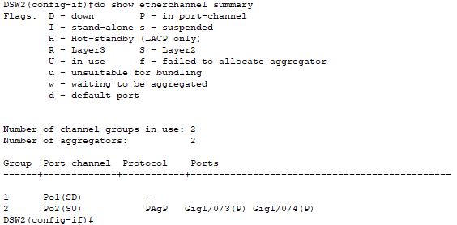

Po2 confirmed active and using PAgP with correct ports.

> Note: Po1 is also visible in this output with no ports assigned. This was created accidentally by mistyping command and has no effect on the configuration. It is cleaned up in Task 3.

```
DSW2(config-if)# do show interfaces trunk
```

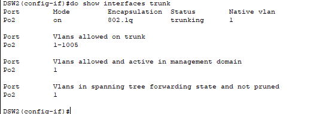

Po2 confirmed trunking.

---

### Task 3 - Configure Layer 3 EtherChannel between DSW1 and DSW2 using static EtherChannel.

Layer 3 EtherChannel combines multiple physical routed links into a single logical routed interface. Static EtherChannel uses `mode on`, which forces the ports into the channel without any negotiation protocol.

**DSW1:**

```
DSW1(config)# int range g1/0/1 - 2
DSW1(config-if)# no switchport
DSW1(config-if)# channel-group 1 mode on
```

`no switchport` converts the interfaces from Layer 2 to Layer 3. `channel-group 1 mode on` creates the static EtherChannel.

**DSW2:**

```
DSW2(config)# int range g1/0/1 - 2
DSW2(config-if-range)# no switchport
DSW2(config-if-range)# channel-group 2 mode on
```

I tried this command, however it resulted in a cannot bundle error.

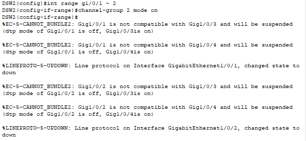

I had accidentally used the same channel group number as the trunking ports connected to ASW2 (channel-group 2). The output showed G1/0/1 and G1/0/2 being added to the wrong group alongside G1/0/3 and G1/0/4.

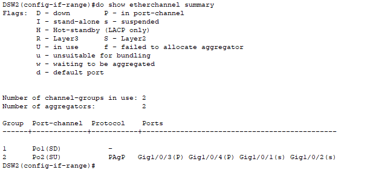

To fix this, I removed G1/0/1 and G1/0/2 from the wrong channel group:

```
DSW2(config-if-range)# no channel-group
```

Before adding them to the correct channel group, I also needed to make the ports Layer 3 first:

```
DSW2(config-if-range)# no switchport
DSW2(config-if-range)# channel-group 1 mode on
```

This was rejected again with the error: "Either port is L2 and port-channel is L3, or vice-versa."

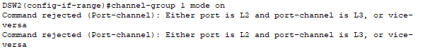

This happened because Po1 had been created earlier by accident as a Layer 2 interface. Even though the physical ports were now Layer 3, the port-channel logical interface itself was still Layer 2. I had to go into the Po1 interface and convert it to Layer 3 as well:

```
DSW2(config-if-range)# int po1
DSW2(config-if)# no switchport
```

Then back into the interface range to finally add them to the channel group:

```
DSW2(config-if)# int range g1/0/1 - 2
DSW2(config-if-range)# channel-group 1 mode on
```

**Verification:**

```
DSW1(config)# do show etherchannel summary
```

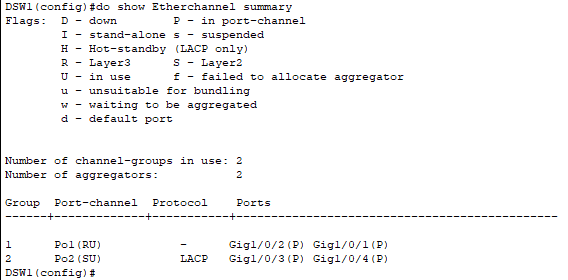

```
DSW2(config-if-range)# do show etherchannel summary
```

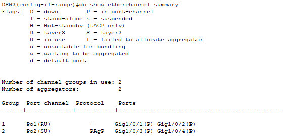

Both switches show the correct EtherChannel configurations.

**IP Address Configuration:**

```
DSW1(config)# int po1
DSW1(config-if)# ip address 10.0.0.1 255.255.255.252

DSW2(config)# int po1
DSW2(config-if)# ip address 10.0.0.2 255.255.255.252
```

IP addresses are assigned directly to the Layer 3 port-channel logical interface.

```
DSW1(config-if)# do ping 10.0.0.2
```

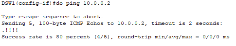

Ping successful, confirming the Layer 3 EtherChannel between DSW1 and DSW2 is working correctly.

---

### Task 4 - Configure routes to allow the PCs to reach SRV1.

**DSW1:**

```
DSW1(config)# ip routing
DSW1(config)# ip route 172.16.2.0 255.255.255.0 10.0.0.2
```

`ip routing` enables Layer 3 routing on DSW1. The static route points traffic destined for the server subnetwork (172.16.2.0/24) toward DSW2 via 10.0.0.2 as the next hop.

**DSW2:**

```
DSW2(config)# ip routing
DSW2(config)# ip route 172.16.1.0 255.255.255.0 10.0.0.1
```

DSW2 is given a return route pointing traffic destined for the PC subnet (172.16.1.0/24) back toward DSW1 via 10.0.0.1 as the next hop.

**Testing:**

The PCs were already pre-configured with a default gateway, so a ping was tried straight away from PC1 to SRV1.

The first request timed out, however this is expected as ARP needs time to resolve the MAC addresses before the first ICMP reply can come back. The remaining replies were all successful.

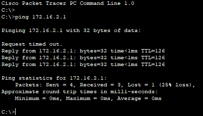

---

### Task 5 - What is the default EtherChannel load-balancing method used on each switch?

Found using:

```
SWx# show etherchannel load-balance
```

| Switch | Default Load-Balance Method  |
|--------|------------------------------|
| ASW1   | src-mac (Source MAC Address) |
| DSW1   | src-mac (Source MAC Address) |
| ASW2   | src-mac (Source MAC Address) |
| DSW2   | src-mac (Source MAC Address) |

All four switches have source MAC address load balancing by default.

---

### Task 6 - Configure the switches to load-balance based on source and destination IP addresses.

```
SWx(config)# port-channel load-balance src-dst-ip
```

This command was used on all four switches. It changes the load-balancing method to use both the source and destination IP address, rather than the Source MAC Address default.

**Verification:**

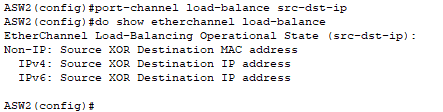

All switches output the same result or similiar (slightly different on Layer 3 switches).

---

## Verification Summary

| Task | Verified Via |
|------|-------------|
| Task 1 LACP EtherChannel | `show etherchannel summary` and `show interfaces trunk` on ASW1 and DSW1 |
| Task 2 PAgP EtherChannel | `show etherchannel summary` and `show interfaces trunk` on ASW2 and DSW2 |
| Task 3 Static Layer 3 EtherChannel | `show etherchannel summary` on DSW1 and DSW2, ping between 10.0.0.1 and 10.0.0.2 |
| Task 4 Routing | Ping from PC1 to SRV1 successful |
| Task 5 Load-balance default | `show etherchannel load-balance` on all switches |
| Task 6 Load-balance change | `show etherchannel load-balance` confirmed src-dst-ip on all switches |

---

## Key Concepts Demonstrated

| Concept | Description |
|---------|-------------|
| **EtherChannel** | Bundles multiple physical links into a single logical link for increased bandwidth and redundancy |
| **LACP** | Industry standard EtherChannel negotiation protocol, active initiates, passive responds |
| **PAgP** | Cisco proprietary EtherChannel negotiation protocol, desirable initiates, auto responds |
| **Static EtherChannel** | Forces ports into a channel with `mode on`, no negotiation protocol used |
| **Layer 2 EtherChannel** | Logical link operates as a switched trunk or access port |
| **Layer 3 EtherChannel** | Logical link operates as a routed interface, requires `no switchport` on member ports and port-channel interface |
| **Port-channel** | The logical interface representing the EtherChannel bundle |
| **Load Balancing** | Distributes traffic across EtherChannel member links based on a chosen method |
| **src-dst-ip** | Load-balance method using source and destination IP, provides better traffic distribution than src-mac alone |

---

## Reflection

Task 3 was the most challenging due to a series of mistakes I made that added onto each other. Using the wrong channel group number, then forgetting to convert the port-channel logical interface to Layer 3 as well as the physical ports, meant working through multiple errors before the configuration was correct. Each error had a clear reason behind it though, and working through them gave a much better understanding of how Layer 3 EtherChannel actually works compared to just following the commands cleanly.

---

*Lab file: `Day_23_Lab_-_EtherChannel.pkt`*  
*Jeremy's IT Lab - Day 23 | Independent CCNA Study*
