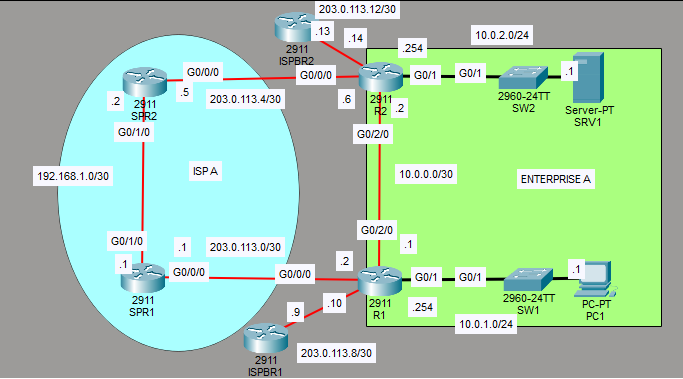
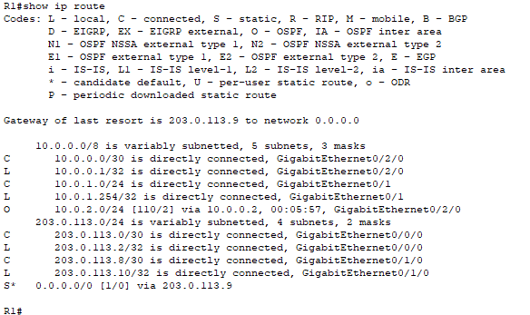
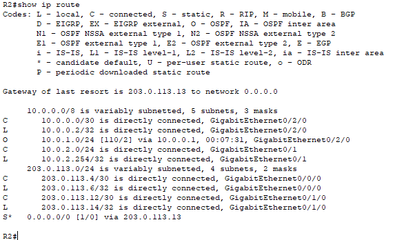
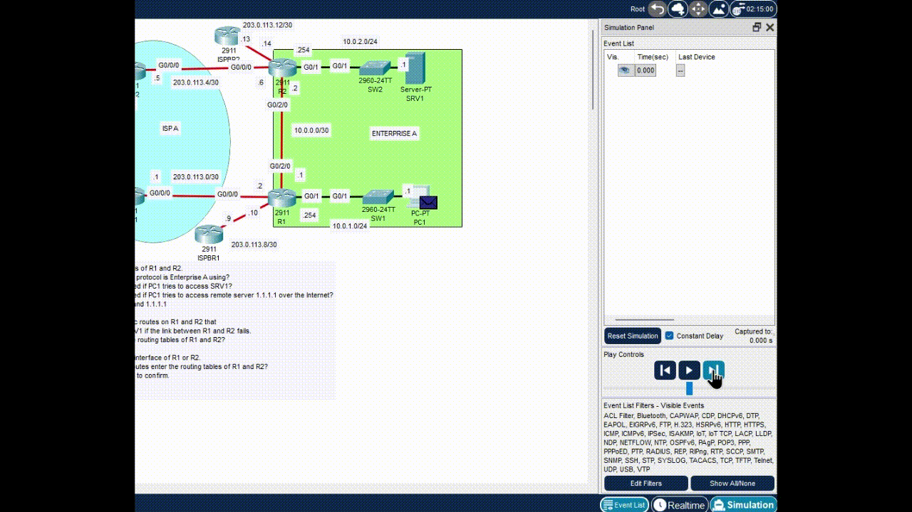
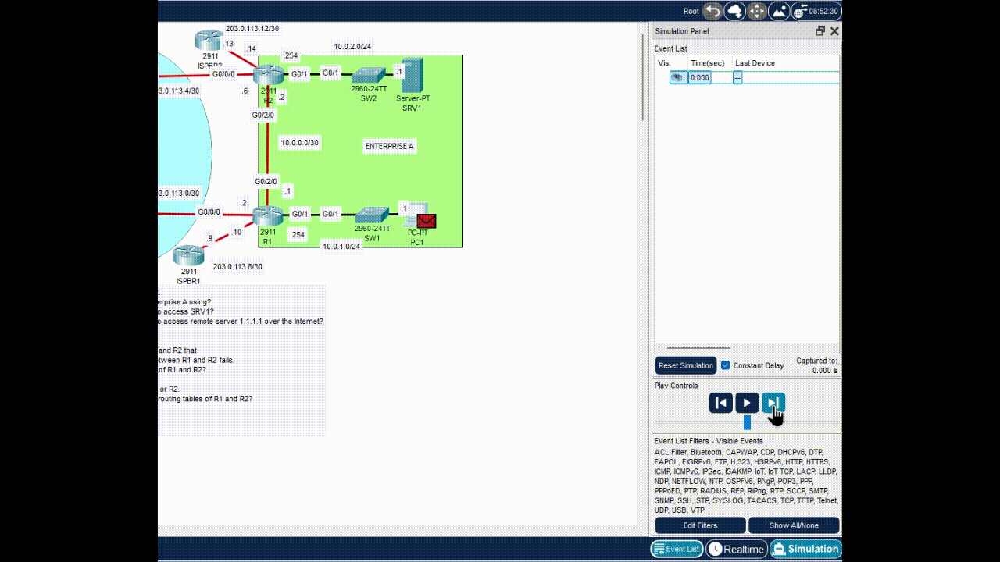
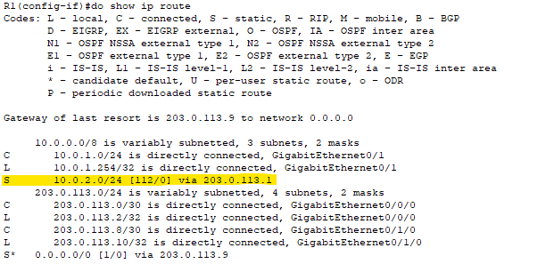
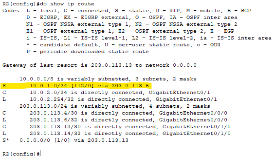
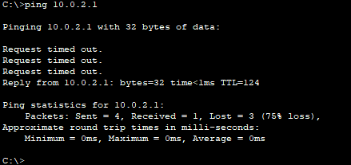
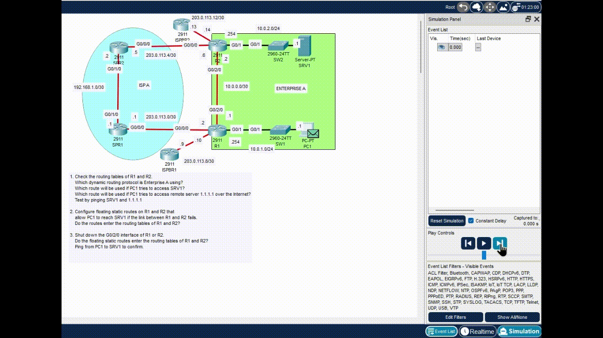

# Lab 24 - Floating Static Routes

**Platform:** Cisco Packet Tracer  
**Source:** Jeremy's IT Lab - Day 24  
**Category:** Network / Routing  
**Difficulty:** Intermediate

---

## Objective

Configure and verify floating static routes as backup paths in a multi-router topology. This lab covers reading routing tables, identifying dynamic routing protocols, understanding Administrative Distance, and configuring floating static routes that only activate when a preferred dynamic route fails.

---

## Topology Overview



Enterprise A runs two routers (R1 and R2) connected via an internal link, with connectivity to an ISP for internet access. SRV1 sits behind R2 on the 10.0.2.0/24 subnet, and PC1 sits behind R1 on the 10.0.1.0/24 subnet.

| Device | Role |
|--------|------|
| R1     | Edge router for PC1 subnet (10.0.1.0/24) |
| R2     | Edge router for SRV1 subnet (10.0.2.0/24) |
| PC1    | End host on 10.0.1.0/24 |
| SRV1   | Server on 10.0.2.0/24 |

---

## Lab Tasks

---

### Task 1 - Check the routing tables of R1 and R2. Which dynamic routing protocol is Enterprise A using? Which route will be used if PC1 tries to access SRV1? Which route will be used if PC1 tries to access remote server 1.1.1.1 over the Internet? Test by pinging SRV1 and 1.1.1.1.

**Commands used:**
```
R1# show ip route
R2# show ip route
```

**R1 Routing Table:**



**R2 Routing Table:**



**Which dynamic routing protocol is Enterprise A using?**

OSPF. This can be seen by the O code present on both routing tables, as well as the AD value of 110, which is unique to OSPF.

**Which route will be used if PC1 tries to access SRV1?**

It will use R1 and R2's OSPF route, as it is the only matching route for SRV1's subnet and vice versa.

**Which route will be used if PC1 tries to access remote server 1.1.1.1 over the Internet?**

It will use R1's static default route to 0.0.0.0/0 via 203.0.113.9. As there are no other matching routes for 1.1.1.1, the router falls back to the default route.

**Test by pinging SRV1 and 1.1.1.1:**

> Note: Both GIFs below show the ping process after ARP has already been resolved.

ICMP packets from PC1 to SRV1 and back, via the OSPF route:



ICMP packets from PC1 to 1.1.1.1 and back, via the default route through 203.0.113.9:



---

### Task 2 - Configure floating static routes on R1 and R2 that allow PC1 to reach SRV1 if the link between R1 and R2 fails. Do the routes enter the routing tables of R1 and R2?

A floating static route is a static route configured with a higher AD than the dynamic routing protocol in use. This ensures the static route stays out of the routing table while the dynamic route is active, only appearing as a backup if the dynamic route goes down.

**R1:**

```
R1(config)# ip route 10.0.2.0 255.255.255.0 203.0.113.1 112
```

The format for a floating static route is:
```
ip route [network-address] [subnet-mask] [next-hop-ip] [ad-value]
```

An AD of 112 was chosen as OSPF has an AD of 110. The floating static route needs a higher AD so it does not replace the OSPF route in the routing table, only acting as a backup in the event the dynamic route goes down.

R2 also needs a floating static route configured so that reply traffic from SRV1 can reach PC1 in the event of OSPF route failure.

**R2:**

```
R2(config)# ip route 10.0.1.0 255.255.255.0 203.0.113.5 112
```

**Do the routes enter the routing tables of R1 and R2?**

No. Because the floating static routes have been configured with an AD higher than the OSPF route, the router automatically prefers the dynamic OSPF route. The floating static routes only appear in the routing table if the OSPF route goes down.

---

### Task 3 - Shut down the G0/2/0 interface of R1 or R2. Do the floating static routes enter the routing tables of R1 and R2? Ping from PC1 to SRV1 to confirm.

**R1:**

```
R1(config)# int g0/2/0
R1(config-if)# shutdown
```

This shuts down the G0/2/0 interface that connects the 10.0.1.0/24 network to the 10.0.2.0/24 network, disabling the dynamic OSPF route between the two.

**Do the floating static routes enter the routing tables of R1 and R2?**

**R1:**



Yes. The floating static route has entered R1's routing table in place of the OSPF route, offering an alternate path to SRV1's network via 203.0.113.1.

**R2:**



Yes. The floating static route has entered R2's routing table as well, in place of the now unavailable OSPF route, offering an alternate path to PC1's network via 203.0.113.5.

As seen in both screenshots, the AD value of 112 configured earlier has allowed the floating static route to properly take over, with OSPF taking priority when available and the static route filling in when it is not.

**Ping from PC1 to SRV1 to confirm:**



The first 3 ICMP echo requests timed out. This is expected as ARP needs to be resolved across all the routers that were previously unused for this path before the first successful reply comes back.



As shown in the GIF, the ICMP echo requests and replies both follow the configured floating static route, travelling through R1 and R2 before being sent through ISP A's autonomous system.

---

## Verification Summary

| Task | Verified Via |
|------|-------------|
| Routing protocol identification | `show ip route` - O code and AD 110 confirmed OSPF on both R1 and R2 |
| Route selection for SRV1 | OSPF route confirmed as only matching route for 10.0.2.0/24 |
| Route selection for 1.1.1.1 | Default static route 0.0.0.0/0 confirmed as fallback |
| Ping tests | Packet Tracer's simulation mode confirmed correct packet paths for both destinations |
| Floating static routes not in table | Confirmed absent from routing tables while OSPF active |
| Floating static routes after shutdown | `show ip route` confirmed S (static) routes on both R1 and R2 after G0/2/0 shutdown |
| Connectivity after failover | Ping from PC1 to SRV1 successful via floating static route |

---

## Key Concepts Demonstrated

| Concept | Description |
|---------|-------------|
| **OSPF** | Open Shortest Path First, a dynamic routing protocol with a default AD of 110 |
| **Administrative Distance (AD)** | A value used to rank the trustworthiness of a route, a lower AD is preferred |
| **Floating Static Route** | A static route with a manually set AD higher than the dynamic route, used as a backup |
| **Default Route** | A catch-all route (0.0.0.0/0) used when no more specific route matches |
| **Route Failover** | When a preferred route goes down, the next best route takes over automatically |
| **ARP** | Address Resolution Protocol, resolves IP addresses to MAC addresses before traffic can flow |

---

## Reflection

The most important concept in this lab is the relationship between Administrative Distance and route preference. By setting the floating static route's AD to 112, just above OSPF's 110, the router always prefers the dynamic route while it is available and falls back to the static route automatically when it is not. This makes floating static routes a simple but effective redundancy tool without requiring any additional dynamic routing configuration.

---

*Lab file: `Day_24_Lab_-_Floating_Static_Routes.pkt`*  
*Jeremy's IT Lab - Day 24 | Independent CCNA Study*
