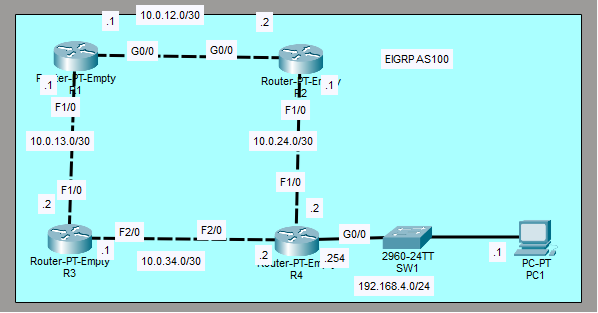
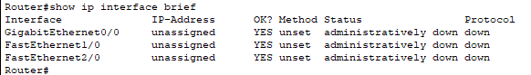
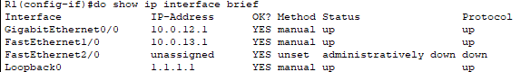
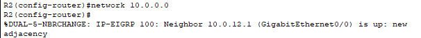
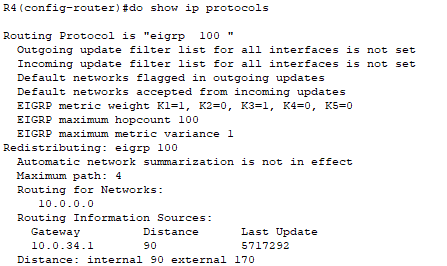
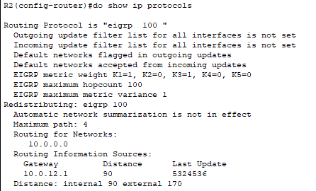
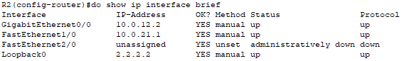
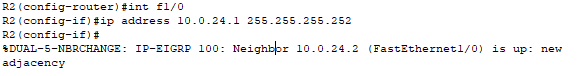
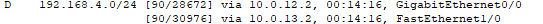

# Lab 25 - EIGRP Configuration

**Platform:** Cisco Packet Tracer  
**Source:** Jeremy's IT Lab - Day 25  
**Category:** Network / Routing  
**Difficulty:** Intermediate

---

## Objective

Configure and verify EIGRP across a four-router topology. This lab covers hostname and IP address configuration, loopback interface setup, EIGRP neighbour adjacencies, passive interfaces, auto-summary and unequal-cost load-balancing using variance.

---

## Topology Overview



A four-router topology (R1, R2, R3, R4) with PC1 connected to R4's local network. All devices required full configuration from scratch including hostnames, IP addresses and routing.

| Device | Interfaces Configured |
|--------|-----------------------|
| R1     | G0/0, F1/0, Loopback0 (1.1.1.1/32) |
| R2     | G0/0, F1/0, Loopback0 (2.2.2.2/32) |
| R3     | F1/0, F2/0, Loopback0 (3.3.3.3/32) |
| R4     | F1/0, F2/0, G0/0, Loopback0 (4.4.4.4/32) |
| PC1    | 192.168.4.1/24, Gateway 192.168.4.254 |

---

## Lab Tasks

---

### Task 1 - Configure the appropriate hostnames and IP addresses on each device. Enable router interfaces.

All routers were unconfigured on startup, with default hostnames of "Router" and no IP addresses assigned. This was verified on each router using:

```
Router# show ip interface brief
```
All outputting something similar to this:    



**Hostnames:**

Hostnames were configured using:
```
Router(config)# hostname [Rx]
```

Each router was assigned its respective hostname (R1, R2, R3, R4) to match the topology labels.

**IP Addresses:**

**R1:**
```
R1(config)# int g0/0
R1(config-if)# ip address 10.0.12.1 255.255.255.252
R1(config-if)# no shutdown

R1(config-if)# int f1/0
R1(config-if)# ip address 10.0.13.1 255.255.255.252
R1(config-if)# no shutdown
```

**R2:**
```
R2(config)# int g0/0
R2(config-if)# ip address 10.0.12.2 255.255.255.252
R2(config-if)# no shutdown

R2(config-if)# int f1/0
R2(config-if)# ip address 10.0.21.1 255.255.255.252
R2(config-if)# no shutdown
```
> Note: This was a misconfiguration for the f1/0 interface, it will become a relevant issue further on.

**R3:**
```
R3(config)# int f1/0
R3(config-if)# ip address 10.0.13.2 255.255.255.252
R3(config-if)# no shutdown

R3(config-if)# int f2/0
R3(config-if)# ip address 10.0.34.1 255.255.255.252
R3(config-if)# no shutdown
```

**R4:**
```
R4(config)# int f1/0
R4(config-if)# ip address 10.0.24.2 255.255.255.252
R4(config-if)# no shutdown

R4(config-if)# int f2/0
R4(config-if)# ip address 10.0.34.2 255.255.255.252
R4(config-if)# no shutdown

R4(config-if)# int g0/0
R4(config-if)# ip address 192.168.4.254 255.255.255.0
R4(config-if)# no shutdown
```

**PC1:**

| Setting | Value |
|---------|-------|
| IP Address | 192.168.4.1 |
| Subnet Mask | 255.255.255.0 |
| Default Gateway | 192.168.4.254 |

---

### Task 2 - Configure a loopback interface on each router (1.1.1.1/32 for R1, 2.2.2.2/32 for R2, etc.)

I was unfamiliar with loopback interfaces and had not configured one before, so I watched the tutorial video for this task.

A loopback interface is a virtual interface on the router. It is created with the following command:

```
R1(config)# interface loopback [number] 
```
In this case, the number was set to "0"

This creates the interface and sets it to up / up automatically. It can then be configured just like a physical interface. A /32 subnet mask is commonly used for loopback addresses.

```
R1(config-if)# ip address 1.1.1.1 255.255.255.255
```

This was verified using:
```
R1(config-if)# do show ip interface brief
```



The loopback interface is confirmed as up/up with the correct IP address assigned.

> Note: Jeremy covers loopback interfaces in more detail later in the course. For now the key point is that it is a virtual interface that stays up as long as the router is running.

The same process was repeated for the remaining routers:

**R2:**
```
R2(config)# interface loopback 0
R2(config-if)# ip address 2.2.2.2 255.255.255.255
```

**R3:**
```
R3(config)# interface loopback 0
R3(config-if)# ip address 3.3.3.3 255.255.255.255
```

**R4:**
```
R4(config)# interface loopback 0
R4(config-if)# ip address 4.4.4.4 255.255.255.255
```

---

### Task 3 - Configure EIGRP on each router. Disable auto-summary. Enable EIGRP on each interface (including loopback interfaces). Configure passive interfaces where appropriate (including loopback interfaces).

**Enable EIGRP:**

```
R1(config)# router eigrp 100
R2(config)# router eigrp 100
R3(config)# router eigrp 100
R4(config)# router eigrp 100
```

The AS number (100) must match on all routers, or they will not share routing information with each other.

**Disable auto-summary:**

```
R1(config-router)# no auto-summary
R2(config-router)# no auto-summary
R3(config-router)# no auto-summary
R4(config-router)# no auto-summary
```

Auto-summary automatically converts advertised networks to classful boundaries, which is not wanted in most modern networks. Disabling it ensures subnets are advertised correctly.

**Enable EIGRP on 10.x.x.x interfaces:**

Since all routers have interfaces in the 10.x.x.x range, a single non-specific network command covers all of them at once:

```
R1(config-router)# network 10.0.0.0
R2(config-router)# network 10.0.0.0
R3(config-router)# network 10.0.0.0
R4(config-router)# network 10.0.0.0
```

Once EIGRP was activated on neighbouring routers, the CLI confirmed new adjacencies were being formed:



**Troubleshooting - Missing R2 and R4 adjacency:**

During configuration, no EIGRP adjacency appeared between R2 and R4. This was investigated using:

```
R4(config-router)# do show ip protocols
```



R4 only showed a connection to 10.0.34.1 (R3), with no entry for R2. The same command was run on R2:

```
R2(config-router)# do show ip protocols
```



R2 also only showed a connection to R1, with no entry for R4. R1 and R3 were also checked and both had the correct two entries in their routing information sources, so the problem was isolated to R2 and R4.

To troubleshoot further, the IP interface brief was checked on R2:

```
R2# show ip interface brief
```



The problem was immediately visible. The F1/0 interface on R2 had been configured with the wrong IP address, `10.0.21.1` instead of `10.0.24.1`. This was a typo made during Task 1.

This was corrected using:

```
R2(config-router)# int f1/0
R2(config-if)# ip address 10.0.24.1 255.255.255.252
```

The CLI immediately confirmed a new adjacency with 10.0.24.2 (R4):



**Enable EIGRP on loopback interfaces:**

The loopback interfaces were not covered by the `network 10.0.0.0` command as they use different address ranges. Each router's loopback was enabled separately:

```
R1(config-router)# network 1.0.0.0
R2(config-router)# network 2.0.0.0
R3(config-router)# network 3.0.0.0
R4(config-router)# network 4.0.0.0
```

R4's local network interface also needed to be included so that the 192.168.4.0/24 route is advertised to the other routers:

```
R4(config-router)# network 192.168.4.0
```

This was verified on each router using:

```
Rx(config-router)# do show ip eigrp interfaces
```

**Configure passive interfaces:**

Loopback interfaces must be set as passive because EIGRP would otherwise attempt to send hello messages out of them, even though they are not connected to any other device. R4's local-facing interface (toward PC1) must also be passive for the same reason.

```
R1(config-router)# passive-interface loopback 0
R2(config-router)# passive-interface loopback 0
R3(config-router)# passive-interface loopback 0
R4(config-router)# passive-interface loopback 0
R4(config-router)# passive-interface g0/0
```

This was verified using `show ip protocols` on each router, which confirmed:

```
Passive Interface(s):
    GigabitEthernet0/0 (R4 only)
    Loopback0
```

---

### Task 4 - Configure R1 to perform unequal-cost load-balancing when sending network traffic to 192.168.4.0/24.

I had no prior knowledge of unequal-cost load-balancing before this task and watched the tutorial video to understand the concept.

By default, EIGRP only load-balances across equal-cost paths. The `variance` command allows EIGRP to include alternate paths in load-balancing, as long as their metric falls within a specified multiplier of the best route's metric.

```
R1(config-router)# variance [2]
```

This allows R1 to load-balance across any routes with a metric up to 2x the value of the best route.

This was verified using:

```
R1(config-router)# do show ip route
```



Two routes are now shown for 192.168.4.0/24, one via R2 (the best route) and one via R3 (the alternate route). The R3 route's metric falls within 2x the metric of R2's route, so it qualifies under the variance 2 setting.

---

## Verification Summary

| Task | Verified Via |
|------|-------------|
| Hostnames and IP addresses | `show ip interface brief` on each router |
| Loopback interfaces | `show ip interface brief` on R1 confirmed Loopback0 up with 1.1.1.1 |
| EIGRP adjacencies | CLI adjacency messages and `show ip protocols` on each router |
| IP typo fix | `show ip interface brief` on R2 identified wrong IP, adjacency confirmed after correction |
| Loopback EIGRP | `show ip eigrp interfaces` on each router |
| Passive interfaces | `show ip protocols` confirmed Loopback0 listed as passive on all routers |
| Unequal-cost load-balancing | `show ip route` on R1 confirmed 2 routes for 192.168.4.0/24 |

---

## Key Concepts Demonstrated

| Concept | Description |
|---------|-------------|
| **EIGRP** | Enhanced Interior Gateway Routing Protocol. A Cisco advanced distance-vector routing protocol |
| **AS Number** | Autonomous System number, must match on all routers for EIGRP to share routing information |
| **Auto-summary** | Automatically summarises routes to classful boundaries, disabled to preserve subnet accuracy |
| **Loopback Interface** | A virtual interface on a router that stays up as long as the router is running |
| **Passive Interface** | Prevents EIGRP hello messages from being sent out of an interface while still advertising the network |
| **Network Command** | Activates EIGRP on interfaces whose IP addresses fall within the specified range |
| **Variance** | Allows EIGRP to perform unequal-cost load-balancing across routes within a specified metric multiplier |
| **Unequal-cost Load-balancing** | Distributing traffic across multiple paths even if they have different metrics |

---

## Reflection

Task 3 had the most going on due to the IP address typo on R2's F1/0 interface that was made back in Task 1. The adjacency between R2 and R4 never formed as a result, and it took checking `show ip protocols` on both routers to isolate the problem before `show ip interface brief` revealed the typo immediately. It was a good reminder to double-check IP address entries during initial configuration. Task 4 was entirely new territory and the variance command was simpler than expected for what it does, one command enabling load-balancing across unequal paths.

---

*Lab file: `Day_25_Lab_-_EIGRP_Configuration.pkt`*  
*Jeremy's IT Lab - Day 25 | Independent CCNA Study*
