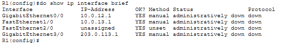
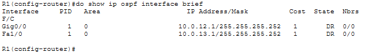
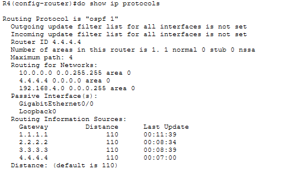
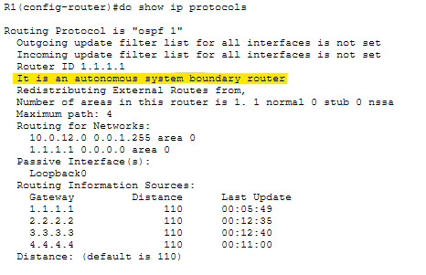
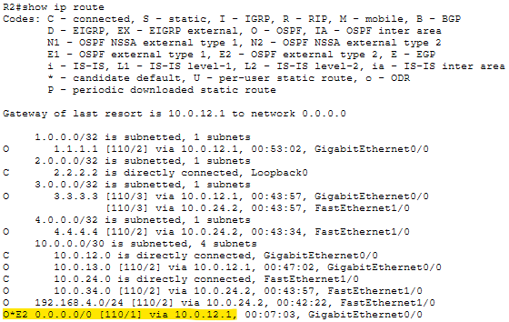
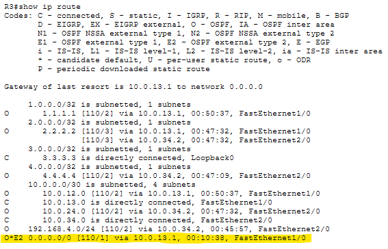
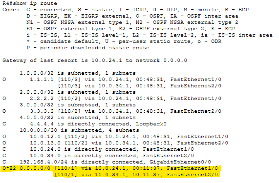

# Lab 26 - OSPF Configuration (Part 1)

**Platform:** Cisco Packet Tracer  
**Source:** Jeremy's IT Lab - Day 26  
**Category:** Network / Routing  
**Difficulty:** Intermediate

---

## Objective

Configure and verify OSPF across a four-router topology. This lab covers hostname and IP address configuration, loopback interfaces, OSPF network commands and wildcard masks, passive interfaces, ASBR default route advertisement and verifying routing tables.

---

## Topology Overview

A four-router topology (R1, R2, R3, R4) with PC1 connected to R4's local network. R1 connects to an ISP router (ISPR1) for internet access. ISPR1 does not require configuration.

| Device | Role |
|--------|------|
| R1     | Edge router / ASBR - connects Enterprise to ISP |
| R2     | Internal router |
| R3     | Internal router |
| R4     | Internal router - connects to PC1 local network |
| PC1    | End host on 192.168.4.0/24 |

---

## Lab Tasks

---

### Task 1 - Configure the appropriate hostnames and IP addresses on each device. Enable router interfaces. (You don't have to configure ISPR1)

All devices were unconfigured on startup and required full manual configuration.

**Hostnames:**

```
Router(config)# hostname [Rx]
```

Each router was assigned its respective hostname in global configuration mode to match the topology labels.

**IP Addressing:**

**R1:**
```
R1(config)# int f1/0
R1(config-if)# ip address 10.0.13.1 255.255.255.252

R1(config-if)# int g3/0
R1(config-if)# ip address 203.0.113.1 255.255.255.252

R1(config-if)# int g0/0
R1(config-if)# ip address 10.0.12.1 255.255.255.252
```

**R2:**
```
R2(config)# int g0/0
R2(config-if)# ip address 10.0.12.2 255.255.255.252

R2(config-if)# int f1/0
R2(config-if)# ip address 10.0.24.1 255.255.255.252
```

**R3:**
```
R3(config)# int f1/0
R3(config-if)# ip address 10.0.13.2 255.255.255.252

R3(config-if)# int f2/0
R3(config-if)# ip address 10.0.34.1 255.255.255.252
```

**R4:**
```
R4(config)# int f2/0
R4(config-if)# ip address 10.0.34.2 255.255.255.252

R4(config-if)# int f1/0
R4(config-if)# ip address 10.0.24.2 255.255.255.252

R4(config-if)# int g0/0
R4(config-if)# ip address 192.168.4.254 255.255.255.0
```

**PC1:**

| Setting | Value |
|---------|-------|
| IP Address | 192.168.4.1 |
| Subnet Mask | 255.255.255.0 |
| Default Gateway | 192.168.4.254 |

After configuring the IP addresses, the interfaces were verified using `show ip interface brief`. All interfaces were showing as administratively down:



The `no shutdown` command was applied to all relevant interfaces on each router to bring them up:

```
Rx(config)# int [interface]
Rx(config-if)# no shutdown
```

---

### Task 2 - Configure a loopback interface on each router (1.1.1.1/32 for R1, 2.2.2.2/32 for R2, etc.)

**R1:**
```
R1(config)# interface loopback 0
R1(config-if)# ip address 1.1.1.1 255.255.255.255
```

**R2:**
```
R2(config)# interface loopback 0
R2(config-if)# ip address 2.2.2.2 255.255.255.255
```

**R3:**
```
R3(config)# interface loopback 0
R3(config-if)# ip address 3.3.3.3 255.255.255.255
```

**R4:**
```
R4(config)# int loopback 0
R4(config-if)# ip address 4.4.4.4 255.255.255.255
```

> Note: Loopback interfaces automatically enter an up/up state when created, so `no shutdown` is not needed.

---

### Task 3 - Configure OSPF on each router. Enable OSPF on each interface (including loopback interfaces). Do not enable OSPF on R1's Internet link. Configure passive interfaces where appropriate (including loopback interfaces).

**Enable OSPF:**

**R1:**
```
R1(config)# router ospf 1
R1(config-router)# network 10.0.12.0 0.0.1.255 area 0
```

A wildcard mask of `0.0.1.255` was used to cover both the 10.0.12.0 and 10.0.13.0 networks in a single command. These networks differ by only 1 bit in the third octet, so this mask catches both without risk of including unintended interfaces.

This was verified using:
```
R1(config-router)# do show ip ospf interface brief
```



Both G0/0 and F1/0 are confirmed in OSPF area 0 with no unintended interfaces included.

```
R1(config-router)# network 1.1.1.1 0.0.0.0 area 0
```

A wildcard of `0.0.0.0` was used here to be as specific as possible, ensuring only the loopback interface is matched.

> Note: OSPF was not activated on R1's G3/0 interface (203.0.113.1) as per the task instructions. From this point on, broader wildcard masks were used for convenience in this lab environment. In a real network, more specific masks would be used.

**R2:**
```
R2(config)# router ospf 1
R2(config-router)# network 10.0.0.0 0.0.255.255 area 0
R2(config-router)# network 2.2.2.2 0.0.0.0 area 0
```

**R3:**
```
R3(config)# router ospf 1
R3(config-router)# network 10.0.0.0 0.0.255.255 area 0
R3(config-router)# network 3.3.3.3 0.0.0.0 area 0
```

**R4:**
```
R4(config)# router ospf 1
R4(config-router)# network 10.0.0.0 0.0.255.255 area 0
R4(config-router)# network 4.4.4.4 0.0.0.0 area 0
R4(config-router)# network 192.168.4.0 0.0.0.255 area 0
```

**Configure passive interfaces:**

Passive interfaces are to be configured on all loopback interfaces and on R4's local network interface (G0/0). This stops OSPF hello messages from being sent out of these interfaces, while still advertising the networks they belong to via LSAs (Link State Advertisement).

```
R1(config-router)# passive-interface loopback0
R2(config-router)# passive-interface loopback0
R3(config-router)# passive-interface loopback0
R4(config-router)# passive-interface loopback0
R4(config-router)# passive-interface g0/0
```

Verified using `show ip protocols` on each router:



R4's output confirms both Loopback0 and GigabitEthernet0/0 are listed as passive interfaces. The routing information sources also show the router IDs of all neighbours, which are the loopback addresses configured earlier. 
These were selected automatically as router IDs due to being the highest loopback addresses on each router, as no manual router ID was set.

---

### Task 4 - Configure R1 as an ASBR that advertises a default route into the OSPF domain.

An ASBR (Autonomous System Boundary Router) is a router that connects an OSPF domain to an external network and imports external routes into OSPF.

First, a default route was configured on R1 pointing toward ISPR1:

```
R1(config)# ip route 0.0.0.0 0.0.0.0 203.0.113.2
```

Then the default route was advertised into the OSPF domain:

```
R1(config)# router ospf 1
R1(config-router)# default-information originate
```

This configures R1 to generate an LSA containing the default route and flood it to all OSPF neighbours throughout the topology. R1 automatically becomes an ASBR when this command is applied.

Verified using:
```
R1(config-router)# do show ip protocols
```



The output confirms R1 is now an autonomous system boundary router.

---

### Task 5 - Check the routing tables of R2, R3, and R4. What default route(s) were added?

**R2:**
```
R2# show ip route
```



A default route entry `O*E2 0.0.0.0/0` has been added, pointing via 10.0.12.1 toward R1.

**R3:**
```
R3# show ip route
```



A default route entry `O*E2 0.0.0.0/0` has been added, pointing via 10.0.13.1 toward R1.

**R4:**
```
R4# show ip route
```



R4's routing table shows the default route load balanced across two paths, one via R2 (10.0.24.1) and one via R3 (10.0.34.1).

Initially, I thought this was an error. OSPF normally uses ECMP (Equal Cost Multi-Path) load-balancing and the path via R2 uses FastEthernet then GigabitEthernet, while the path via R3 uses two FastEthernet links, making them seemingly unequal in cost.

After researching, this behaviour is due to the default route being an E2 (External Type 2) route. E2 routes only consider the external metric and ignore the internal path cost entirely. Since both paths lead to the same ASBR advertising the same E2 metric, OSPF treats them as equal cost and load-balances across both.

> Note: This is a concept Jeremy (IT Labs) covers in a later video in the course. I was unfamiliar at this stage but noticed the odd routing entry and briefly researched it myself.

---

## Verification Summary

| Task | Verified Via |
|------|-------------|
| Hostnames and IP addresses | `show ip interface brief` on each router |
| Interface shutdown fix | `no shutdown` applied after interfaces found administratively down |
| Loopback interfaces | Confirmed up/up automatically on creation |
| OSPF interfaces | `show ip ospf interface brief` on R1 confirmed correct interfaces in area 0 |
| Passive interfaces | `show ip protocols`, specifically R4 confirmed Loopback0 and G0/0 as passive |
| ASBR confirmation | `show ip protocols` on R1 confirmed ASBR status |
| Default route propagation | `show ip route` on R2, R3, R4 confirmed O*E2 0.0.0.0/0 entries |

---

## Key Concepts Demonstrated

| Concept | Description |
|---------|-------------|
| **OSPF** | Open Shortest Path First, a link-state routing protocol with a default AD of 110 |
| **Wildcard Mask** | The inverse of a subnet mask used in OSPF network commands to define which interfaces to include |
| **Loopback Interface** | A virtual interface often used as a router ID, automatically up/up on creation |
| **Passive Interface** | Stops OSPF hello messages on an interface while still advertising its network |
| **ASBR** | Autonomous System Boundary Router, connects OSPF to an external routing domain |
| **default-information originate** | Advertises a default route into OSPF, triggers ASBR status on the router |
| **E2 Route** | External Type 2 OSPF route, only considers the external metric, ignoring internal path cost |
| **ECMP** | Equal Cost Multi-Path, OSPF load-balances across multiple paths with equal cost |

---

## Reflection

The most interesting part of this lab was the unexpected load-balancing on R4's default route in Task 5. The two paths to R1 appeared to be unequal in cost due to different link bandwidth, but the E2 route behaviour meant internal costs were ignored entirely, causing OSPF to treat both paths as equal. This was not covered in the lab material yet and required research to understand. It is a good example of how expected behaviour in practice does not always match what you expect from theory alone.

---

*Lab file: `Day_26_Lab_-_OSPF__Part_1_.pkt`*  
*Jeremy's IT Lab - Day 26 | Independent CCNA Study*
