# Lab 27 - OSPF Configuration (Part 2)

**Platform:** Cisco Packet Tracer  
**Source:** Jeremy's IT Lab - Day 27  
**Category:** Network / Routing  
**Difficulty:** Intermediate

---

## Objective

Continue building on OSPF configuration across a four-router topology. This lab covers enabling OSPF directly on interfaces rather than via network commands, reference bandwidth and cost calculation, ASBR default route advertisement, and inspecting OSPF Hello messages at the packet level using Simulation mode.

---

## Topology Overview

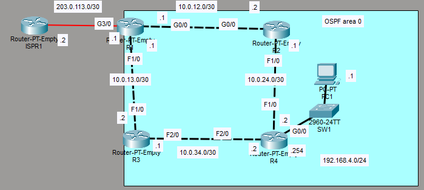

A four-router topology (R1, R2, R3, R4) with PC1 connected to R4's local network. R1 connects to an ISP router (ISPR1) for internet access. ISPR1 does not require configuration.

| Device | Role |
|--------|------|
| R1     | Edge router / ASBR - connects Enterprise to ISP |
| R2     | Internal router |
| R3     | Internal router |
| R4     | Internal router - connects to PC1 local network |
| PC1    | End host on 192.168.4.0/24 |

---

## Lab Tasks

---

### Task 1 - Configure the appropriate hostnames and IP addresses on each device. Enable router interfaces. (You don't have to configure ISPR1)

**Hostnames:**

```
Router> en
Router# conf t
Router(config)# hostname [Rx]
```

Each router was assigned its respective hostname to match the topology labels.

**IP Addressing:**

**R1:**
```
R1(config)# int f1/0
R1(config-if)# ip address 10.0.13.1 255.255.255.252
R1(config-if)# no shutdown

R1(config-if)# int g0/0
R1(config-if)# ip address 10.0.12.1 255.255.255.252
R1(config-if)# no shutdown

R1(config-if)# int g3/0
R1(config-if)# ip address 203.0.133.1 255.255.255.252
R1(config-if)# no shutdown
```

> Note: I made a typo here. This was meant to be 203.0.**113**.1, not 203.0.133.1. I didn't notice the mistake at this point and ended up causing an issue later in Task 5.

**R2:**
```
R2(config)# int g0/0
R2(config-if)# ip address 10.0.12.2 255.255.255.252
R2(config-if)# no shutdown

R2(config-if)# int f1/0
R2(config-if)# ip address 10.0.24.1 255.255.255.252
R2(config-if)# no shutdown
```

**R3:**
```
R3(config)# int f1/0
R3(config-if)# ip address 10.0.13.2 255.255.255.252
R3(config-if)# no shutdown

R3(config-if)# int f2/0
R3(config-if)# ip address 10.0.34.1 255.255.255.252
R3(config-if)# no shutdown
```

**R4:**
```
R4(config)# int f1/0
R4(config-if)# ip address 10.0.24.2 255.255.255.252
R4(config-if)# no shutdown

R4(config-if)# int f2/0
R4(config-if)# ip address 10.0.34.2 255.255.255.252
R4(config-if)# no shutdown

R4(config-if)# int g0/0
R4(config-if)# ip address 192.168.4.254 255.255.255.0
R4(config-if)# no shutdown
```

**PC1:**

| Setting | Value |
|---------|-------|
| IP Address | 192.168.4.1 |
| Subnet Mask | 255.255.255.0 |
| Default Gateway | 192.168.4.254 |

---

### Task 2 - Configure a loopback interface on each router (1.1.1.1/32 for R1, 2.2.2.2/32 for R2, etc.)

> A /32 subnet mask is used for loopback interfaces as it represents a single specific address rather than a network range.

**R1:**
```
R1(config-if)# int loopback 0
R1(config-if)# ip address 1.1.1.1 255.255.255.255
```

**R2:**
```
R2(config-if)# int loopback 0
R2(config-if)# ip address 2.2.2.2 255.255.255.255
```

**R3:**
```
R3(config-if)# int loopback 0
R3(config-if)# ip address 3.3.3.3 255.255.255.255
```

**R4:**
```
R4(config-if)# int loopback 0
R4(config-if)# ip address 4.4.4.4 255.255.255.255
```

This was verified on each router using:
```
Rx(config-if)# do show ip interface brief
```

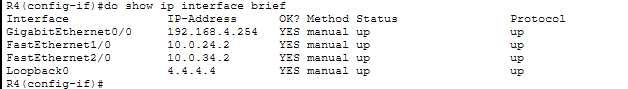

> Note: `do` is needed at the start of this command as `show` is a privileged EXEC level command. Rather than exiting global config mode, adding `do` as a prefix allows it to run from the current configuration mode.

---

### Task 3 - Enable OSPF directly on each interface of the routers. Configure passive interfaces as appropriate.

Unlike previous labs which used the `network` command with wildcard masks, this task asks for OSPF to be enabled directly on each interface using:

```
ip ospf [process-id] area [area-number]
```

This command is entered within interface configuration mode.

**R1:**
```
R1(config)# int g3/0
R1(config-if)# ip ospf 1 area 0

R1(config-if)# int f1/0
R1(config-if)# ip ospf 1 area 0

R1(config-if)# int g0/0
R1(config-if)# ip ospf 1 area 0

R1(config-if)# int loopback 0
R1(config-if)# ip ospf 1 area 0
```

**R2:**
```
R2(config)# int g0/0
R2(config-if)# ip ospf 1 area 0

R2(config-if)# int f1/0
R2(config-if)# ip ospf 1 area 0

R2(config)# int loopback 0
R2(config-if)# ip ospf 1 area 0
```

**R3:**
```
R3(config)# int f1/0
R3(config-if)# ip ospf 1 area 0

R3(config-if)# int f2/0
R3(config-if)# ip ospf 1 area 0

R3(config)# int loopback 0
R3(config-if)# ip ospf 1 area 0
```

While configuring R3, the CLI output confirmed a full adjacency had formed between R3 and R1:

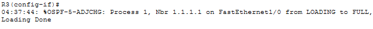

The output breaks down as follows:
- **Process 1** - the OSPF process ID
- **Nbr 1.1.1.1** - the neighbour RID, R1's loopback address which has been used as its router ID
- **FastEthernet1/0 from LOADING to FULL** - the interface transitioning through the OSPF neighbour states LOADING to FULL
- **Loading Done** - confirms the adjacency has been fully formed

**R4:**
```
R4(config)# int f2/0
R4(config-if)# ip ospf 1 area 0

R4(config-if)# int f1/0
R4(config-if)# ip ospf 1 area 0

R4(config-if)# int g0/0
R4(config-if)# ip ospf 1 area 0

R4(config-if)# int loopback 0
R4(config-if)# ip ospf 1 area 0
```

**Configure passive interfaces:**

All loopback interfaces and R4's interface facing PC1's network were configured as passive. Each router first needs to enter router configuration mode:

```
Rx(config)# router ospf 1
```

**R1:**
```
R1(config-router)# passive-interface loopback 0
```

**R2:**
```
R2(config-router)# passive-interface loopback0
```

**R3:**
```
R3(config-router)# passive-interface loopback0
```

**R4:**
```
R4(config-router)# passive-interface loopback0
R4(config-router)# passive-interface g0/0
```

Verified using:
```
Rx(config-router)# do show ip protocols
```

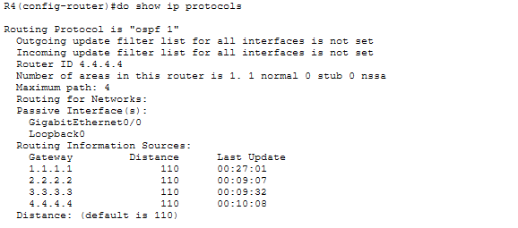

R4's output confirms both Loopback0 and G0/0 are configured as passive interfaces. It also lists all neighbouring routers in the area along with their Administrative Distance and Router IDs.

---

### Task 4 - Configure the reference bandwidth on each router so a FastEthernet interface has a cost of 100.

The OSPF cost formula is:
```
Reference Bandwidth / Interface Bandwidth = Cost
```

For a FastEthernet interface (100 Mbps) to have a cost of 100, the reference bandwidth needs to be set to 10,000, since 10,000 / 100 = 100.

**R1:**
```
R1(config-router)# auto-cost reference-bandwidth 10000
```

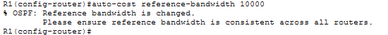

The CLI confirmed the change and gave a reminder that the reference bandwidth must be kept consistent across all routers in the area, otherwise route cost calculations will be inconsistent and lead to incorrect best path selection.

**R2:**
```
R2(config-router)# auto-cost reference-bandwidth 10000
```

**R3:**
```
R3(config-router)# auto-cost reference-bandwidth 10000
```

**R4:**
```
R4(config-router)# auto-cost reference-bandwidth 10000
```

All four routers now share the same reference bandwidth, ensuring accurate route costs across the topology.

---

### Task 5 - Configure R1 as an ASBR that advertises a default route into the OSPF domain.

A default route must be configured first:

```
R1(config)# ip route 0.0.0.0 0.0.0.0 203.0.113.2
```

I tried verifying this using:
```
R1(config)# do show ip route
```

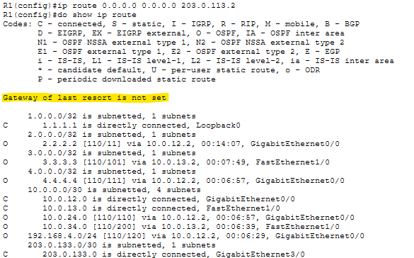

The gateway of last resort was not set, meaning something had gone wrong with the configuration. My first thought was that I had forgotten `no shutdown` on G3/0, so I checked:

```
R1(config)# do show ip interface brief
```

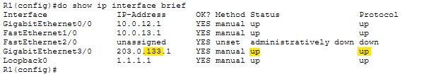

The interface was actually up/up, so that was not the issue. However, checking the IP Adress field, I found the real problem was from Task 1. G3/0 had been configured with the wrong IP address, 203.0.133.1 instead of 203.0.113.1. The static default route pointed to 203.0.113.2, which was completely different to the one actually configured on the interface.

This was corrected with:
```
R1(config)# int g3/0
R1(config-if)# ip address 203.0.113.1 255.255.255.252
```

Verified again:
```
R1(config-if)# do show ip route
```

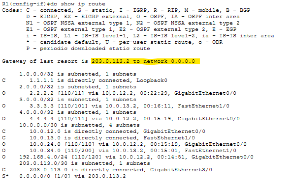

The gateway of last resort was now correctly set to 203.0.113.2.

With the default route working, it was advertised into OSPF:

```
R1(config-if)# router ospf 1
R1(config-router)# default-information originate
```

Verified using:
```
R1(config-router)# do show ip protocols
```

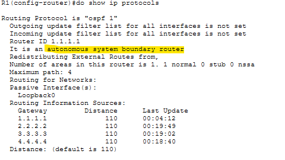

R1 is now confirmed as an autonomous system boundary router.

To make sure this had advertised to other routers correctly, R2's routing table was also checked:

```
R2(config)# do show ip route
```

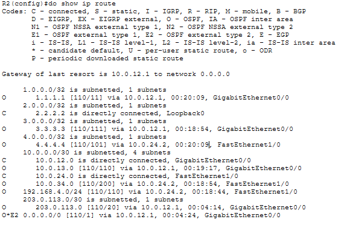

The default route has been acquired by R2 via 10.0.12.1 (R1), confirming the advertisement worked correctly.

---

### Task 6 - Check the routing tables of R4. What default route(s) were added?

```
R4(config)# do show ip route
```

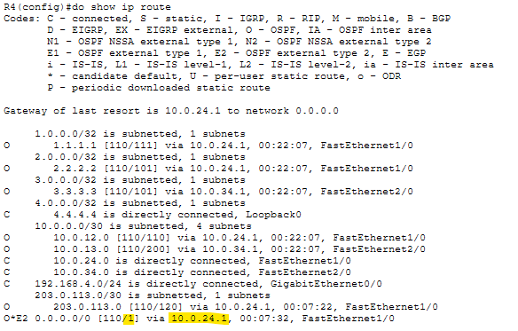

The default route is shown via 10.0.24.1 (R2). This seemed correct at first, as that path uses a GigabitEthernet and FastEthernet connection, while the path via R3 uses two FastEthernet connections and the reference bandwidth was just configured in Task 4, so the costs should now be accurate.

Jeremy (in the lab demonstration) explains that because this is an E2 route (OSPF External Type 2), it ignores internal path cost entirely. Due to this, both the path via R2 and via R3 should technically have equal cost and both appear in the routing table. However, only one is displayed here due to a limitation in Packet Tracer.

I had already encountered an E2 route before in Lab 26, so the concept itself was familiar. The deeper mechanics behind it are covered in the CCNP, so it was not necessary to go further into it at this point.

---

### Task 7 - Use Simulation mode to view the OSPF Hello messages being sent by the routers. What fields are included in the Hello message?

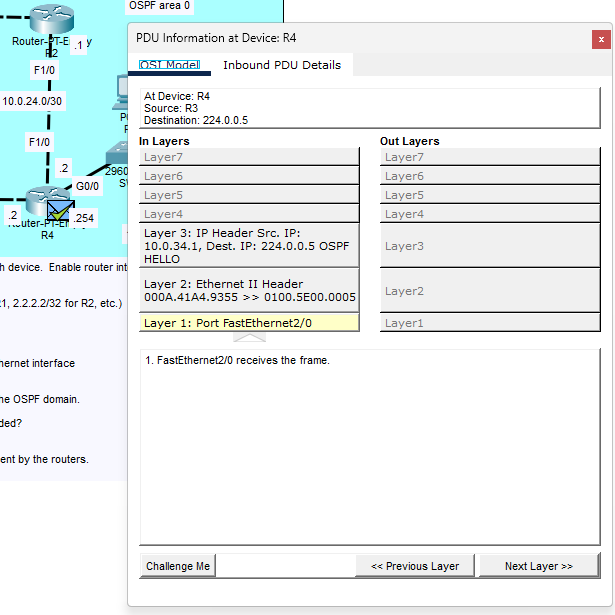

**Layer 3:**

The Layer 3 destination address for this packet is `224.0.0.5`. This is the OSPF multicast address used to reach all OSPF routers on a link, and is the address OSPF Hello messages are sent to.

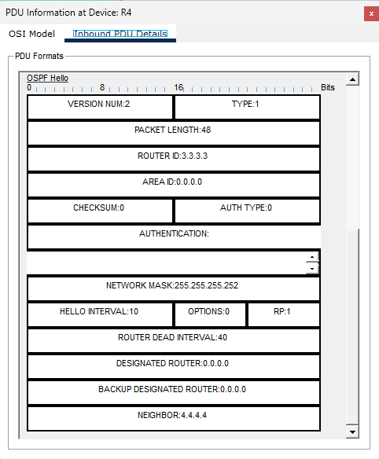

**PDU Details:**

**IP Header:**

- **PRO (Protocol):** Shows a value of `0x59`. This looked incorrect at first since OSPF's protocol number is 89. However 0x59 in hexadecimal is equal to 89 in decimal, meaning this is correctly identifying an OSPF message encapsulated in the IP header.

**OSPF Hello fields:**

I was unfamiliar with several of these fields and used the lab demonstration to understand them:

| Field | Description |
|-------|-------------|
| Version Num | Indicates OSPFv2, used for IPv4 |
| Type | The OSPF message type, 1 represents Hello |
| Router ID | The ID of the sending router, in this case R3 |
| Area ID | The OSPF area number. Displayed as a 32-bit number in 4-octet format, similar to an IPv4 address |
| Network Mask | The subnet mask of the sending interface |
| Hello Interval | The time between Hello messages |
| Router Dead Interval | The timer that counts down before a neighbour is considered down. It resets when a new Hello is received. Default is 40 seconds |
| Designated Router | Not yet covered at this stage |
| Backup Designated Router | Not yet covered at this stage |
| Neighbour | The Router ID of the neighbour this Hello packet is destined for |

---

## Verification Summary

| Task | Verified Via |
|------|-------------|
| Loopback interfaces | `show ip interface brief` confirmed correct addresses on each router |
| Interface-level OSPF | CLI adjacency message confirmed full adjacency on R3 |
| Passive interfaces | `show ip protocols` on R4 confirmed Loopback0 and G0/0 as passive |
| Reference bandwidth | CLI confirmation message on each router after `auto-cost reference-bandwidth` |
| Default route mistake | `show ip route` showed missing gateway of last resort, traced to G3/0 IP typo |
| Default route fix | `show ip route` confirmed gateway of last resort set after correction |
| ASBR confirmation | `show ip protocols` on R1 confirmed ASBR status |
| Default route propagation | `show ip route` on R2 and R4 confirmed O*E2 default route entries |
| OSPF Hello inspection | Simulation mode PDU details confirmed packet fields |

---

## Key Concepts Demonstrated

| Concept | Description |
|---------|-------------|
| **Interface-level OSPF** | Enabling OSPF directly with `ip ospf [process] area [area]` rather than with network commands |
| **OSPF Neighbour States** | LOADING to FULL transition shown when an adjacency forms |
| **Reference Bandwidth** | Determines OSPF cost calculation, must be consistent across all routers in an area |
| **OSPF Cost Formula** | Reference Bandwidth / Interface Bandwidth |
| **ASBR** | Autonomous System Boundary Router. advertises external routes into OSPF |
| **default-information originate** | Advertises a default route into the OSPF domain |
| **E2 Route** | External Type 2 OSPF route, ignores internal path cost, uses only the external metric |
| **OSPF Multicast Address** | 224.0.0.5, used by routers to send OSPF Hello messages to all OSPF neighbours |
| **OSPF Hello Message** | Used for neighbour discovery and maintaining adjacencies; contains router ID, area ID, timers and more |

---

## Reflection

Task 5 was the most valuable part of this lab, not because of the OSPF concept itself but because of the mistake that surfaced from Task 1. A simple typo in the G3/0 IP address, 203.0.133.1 instead of 203.0.113.1, went unnoticed until it caused the default route to fail with no gateway of last resort set. Working backwards from that symptom to the actual cause was a good exercise in troubleshooting and a reminder that small configuration errors made early on can resurface several steps later in ways that are not immediately obvious. Task 7 was also useful for connecting the OSPF theory to the actual packet structure, particularly seeing the protocol number in hex and understanding what each OSPF Hello message field represents.

---

*Lab file: `Day_27_Lab_-_OSPF__Part_2_.pkt`*  
*Jeremy's IT Lab - Day 27 | Independent CCNA Study*
