# Lab 28 - OSPF Configuration (Part 3)

**Platform:** Cisco Packet Tracer
**Source:** Jeremy's IT Lab - Day 28
**Category:** Network / Routing
**Difficulty:** Intermediate

---

## Objective

Troubleshoot and extend an existing OSPF topology. This lab covers serial link configuration, DCE/DTE clock rate setup, OSPF network type mismatches, Hello/Dead timer mismatches, default route advertisement and inspecting the OSPF Link State Database (LSDB).

---

## Topology Overview

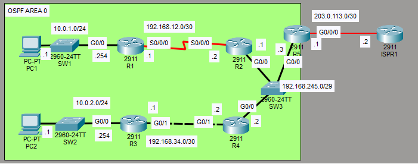

The network was pre-configured with IP addresses and OSPF. A new serial connection between R1 and R2 was added and required manual configuration. R3, R4, and R5 required troubleshooting to resolve OSPF adjacency and routing issues.

| Device | Role |
|--------|------|
| R1     | Internal router - new serial link to R2 |
| R2     | Internal router |
| R3     | Internal router |
| R4     | Internal router |
| R5     | Edge router / ASBR - connects to internet via 203.0.113.2 |

---

## Lab Tasks

---

### Task 1 - The connection between R1 and R2 has been newly added. Configure the serial connection between R1 and R2 (clock rate of 128000). Configure OSPF on R1 and R2.

**IP Address Configuration:**

```
R1(config)# int s0/0/0
R1(config-if)# ip address 192.168.12.1 255.255.255.252

R2(config)# int s0/0/0
R2(config-if)# ip address 192.168.12.2 255.255.255.252
```

**Clock Rate Configuration:**

On serial links, the clock rate must be configured on the DCE side of the connection. To determine which router was the DCE, I used:

```
R2(config-if)# do show controllers s0/0/0
```

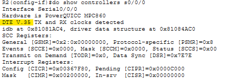

R2 is confirmed as the DTE side, meaning R1 is the DCE and must set the clock rate.

```
R1(config-if)# clock rate 128000
```

Verified using:

```
R1(config-if)# do show controllers s0/0/0
```

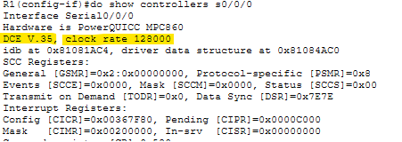

R1 is confirmed as DCE with the clock rate correctly set to 128000.

Both interfaces were then enabled with `no shutdown`.

**OSPF Configuration:**

Before enabling OSPF, I checked the existing process ID to ensure it matched:

```
R1(config-if)# do show ip protocols
```

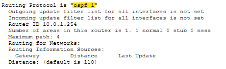

The process ID is 1, so the same must be used on the new serial interfaces.

OSPF was enabled directly on each interface:

**R1:**
```
R1(config)# int s0/0/0
R1(config-if)# ip ospf 1 area 0

R1(config)# int g0/0
R1(config-if)# ip ospf 1 area 0
```

**R2:**
```
R2(config)# int s0/0/0
R2(config-if)# ip ospf 1 area 0

R2(config)# int g0/0
R2(config-if)# ip ospf 1 area 0
```

> Note: OSPF was also enabled on the GigabitEthernet interfaces of R1 and R2 to ensure they were properly advertised, despite the instructions stating the network was pre-configured.

The routing table of R1 was checked to verify:

```
R1(config-if)# do show ip route
```

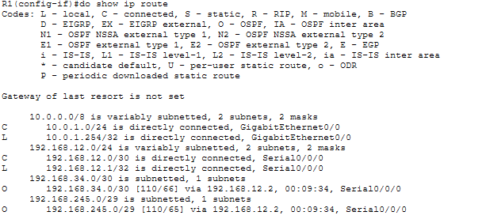

Some OSPF routes had come through, but not all expected routes were present, indicating further issues in the topology to investigate in Task 2.

---

### Task 2 - Only R3 has a route to 10.0.2.0/24. Why? Fix the problem.

**Investigation:**

R3's routing table was checked first:

```
R3(config)# do show ip route
```

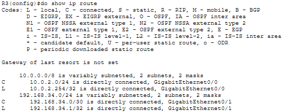

R3 had not received any OSPF routes. All listed routes were directly connected or local, meaning R3 was not communicating with the rest of the OSPF area.

OSPF interface status was checked next:

```
R3(config)# do show ip ospf interface brief
```

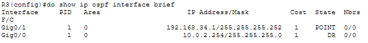

OSPF was confirmed as enabled on both G0/0 and G0/1, so that was not the issue.

The neighbour table was then checked:

```
R3(config)# do show ip ospf neighbor
```

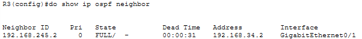

This made me suspicious of a network type mismatch between R3 and R4. R3 was configured as point-to-point and if R4's side of the link was set to broadcast, they would be unable to fully communicate.

R4's G0/1 interface was checked:

```
R4# show ip ospf interface g0/1
```

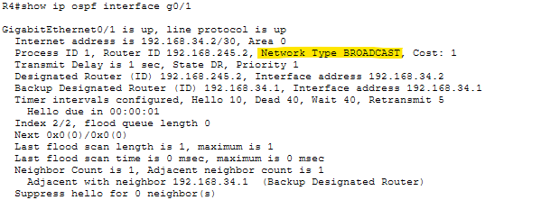

As suspected, R4's G0/1 was set to broadcast while R3's matching interface was set to point-to-point. OSPF requires matching network types on both ends of a link to form a proper adjacency.

**Fix:**

R4's G0/1 was changed to point-to-point. A DR and BDR are not needed on a link between just two routers and point-to-point is not exclusive to serial links, it can be used on Ethernet as well.

```
R4(config)# int g0/1
R4(config-if)# ip ospf network point-to-point
```

**Second issue - missing routes on R2 and R4:**

After fixing the network type, R4's routing table was checked:

```
R4(config-if)# do show ip route
```

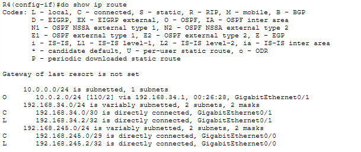

Routes for 192.168.12.0/30 and 10.0.1.0/24 were missing. R2's routing table showed a similar issue:

```
R2(config-if)# do show ip route
```

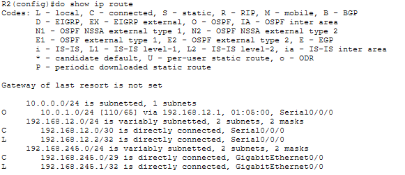

The adjacency between R2 and R4 was checked:

```
R2(config)# do show ip ospf neighbor
```

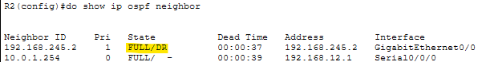

```
R4(config)# do show ip ospf neighbor
```

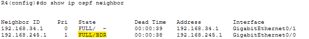

Both showed a full adjacency with no issues. I double checked the OSPF network types were the same using:

**R2:**
```
R2(config-if)# do show ip ospf interface g0/0
```

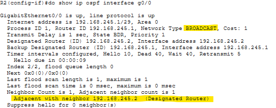

**R4:**
```
R4(config)# do show ip ospf interface g0/0
```

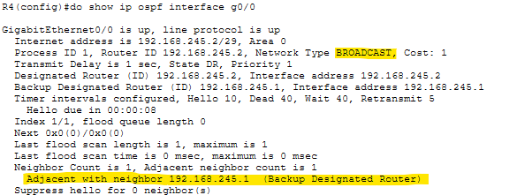

Both interfaces returned correct results with no apparent misconfiguration. Everything looked right but the routes still were not being shared.

After researching the issue, including checking the comments on the lab demonstration, others had encountered the same problem. The fix was to shut R2's G0/0 interface off and on again, shutting it down and immediately bringing it back up:

```
R2(config)# int g0/0
R2(config-if)# shutdown
R2(config-if)# no shutdown
```

After the interfaces re-established their adjacencies, the routing tables were checked again:

**R2:**

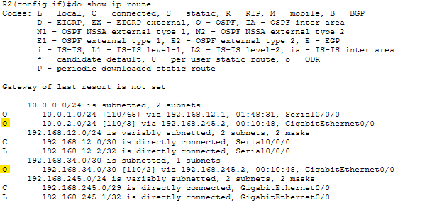

**R4:**

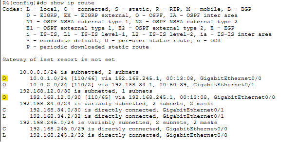

Both routers now had the correct routes. This turned out to be a Packet Tracer bug rather than a misconfiguration, the adjacency appeared fully formed but routes were not being exchanged correctly until the interface was restarted. I spent 30+ minutes troubleshooting before finding out this was a known Packet Tracer issue. That said, this kind of troubleshooting, checking routing tables, neighbour states, interface configs and working through each possible cause is directly applicable to real network environments where similar symptoms can have misconfiguration as the root cause. So all in all, not a waste of time.

---

### Task 3 - R2 and R4 won't become OSPF neighbors with R5. Why? Fix the problem.

**Investigation:**

R5's OSPF interface configuration was checked:

```
R5(config)# do show ip ospf interface g0/0
```

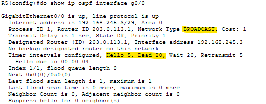

The network type was correct (broadcast), however the Hello and Dead timers were set to 5 and 20 respectively. R2 and R4 use the OSPF defaults of Hello 10 and Dead 40.
OSPF will not form adjacencies between routers with mismatched Hello and Dead timers.

**Fix:**

Rather than changing R2 and R4's timers, R5's timers were reset to the defaults using:

```
R5(config)# int g0/0
R5(config-if)# no ip ospf hello-interval
R5(config-if)# no ip ospf dead-interval
```

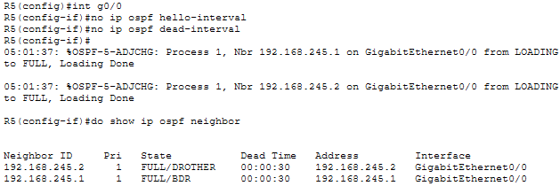

Shortly after resetting the timers, R5 formed full adjacencies with both R2 and R4.

> Note: The output shows R4 (192.168.245.2) listed as DROTHER after R5 joined the network. Before R5 was added, R4 was the DR and R2 the BDR. Adding a new router should not change these roles as the DR/BDR election is non-preemptive. This appears to be another Packet Tracer bug, although it does not affect functionality.

---

### Task 4 - PC1 and PC2 can't ping the external server 8.8.8.8. Why? Fix the problem.

**Verification:**

```
C:\> ping 8.8.8.8
```

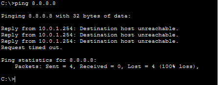

The response is "Destination host unreachable" rather than "Request timed out". This difference matters, as it hints at the cause of the issue. Error message "host unreachable" means the default gateway router itself has no route for the destination and is rejecting the packet locally, rather than the packet being sent out but getting no reply.

**Investigation:**

R5 was checked as it is the ASBR for internet access. Its routing table was inspected first:

```
R5(config)# do show ip route
```

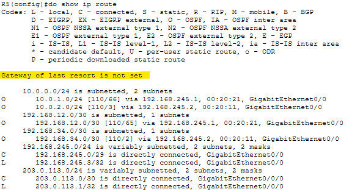

No default route was present on R5, meaning it was not advertising one into the OSPF domain.

**Fix:**

A default route was configured on R5:

```
R5(config)# ip route 0.0.0.0 0.0.0.0 203.0.113.2
```

Verified:

```
R5(config)# do show ip route
```

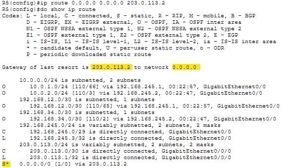

The default route was now present. It was then configured to advertise it into the OSPF domain:

```
R5(config)# router ospf 1
R5(config-router)# default-information originate
```

R2's routing table was checked to confirm the route had been properly advertised and received:

```
R2(config)# do show ip route
```

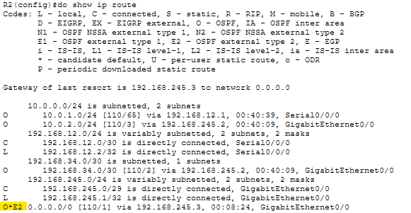

The default route was now in R2's routing table. PC1 was then tested again:

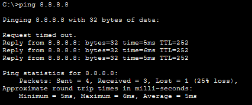

PC1 can now successfully reach 8.8.8.8. 
R4 and PC2 were also confirmed as working correctly.

R5 should now also become an ASBR
This was verified using:

```
R5(config)# do show ip protocols
```

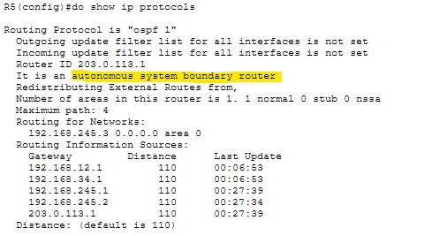

R5 is confirmed as an autonomous system boundary router.

---

### Task 5 - Examine the LSDB. What LSAs are present?

Since all routers in an OSPF area share the same LSDB, any router can be used to check it. R5 was used:

```
R5(config)# do show ip ospf database
```

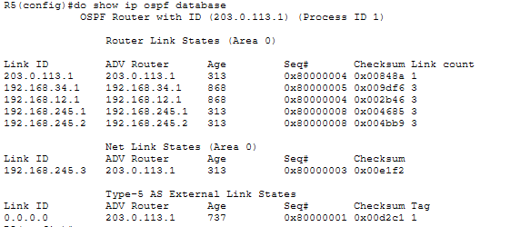

The database contains three types of LSAs:

**Router Link States (Type 1)**

Every router in the OSPF area generates a Type 1 LSA that identifies itself. Although this output doesn't show it, each LSA contains information about the networks that router is connected to. There is one Type 1 LSA per router in the area.

**Net Link States (Type 2)**

There is one Type 2 LSA in this section, generated by the DR of the broadcast network. In this case R5 is shown as the DR (although as noted before, it shouldn't be). No other Type 2 LSAs appear because there is only one broadcast network type in this area. The remaining links are point-to-point, which do not use DR/BDR and in turn do not generate Type 2 LSAs.

**Type 5 AS External Link States**

There is one Type 5 LSA in this section, generated by R5 as the ASBR. It advertises the default route (0.0.0.0/0) to the rest of the OSPF domain, allowing all routers to reach the internet.

---

## Verification Summary

| Task | Verified Via |
|------|-------------|
| DCE/DTE identification | `show controllers s0/0/0` on R1 and R2 |
| Clock rate | `show controllers s0/0/0` on R1 confirmed 128000 set |
| OSPF process ID | `show ip protocols` on R1 confirmed process ID 1 |
| OSPF routes after Task 1 | `show ip route` on R1 confirmed partial OSPF routes |
| R3 missing routes | `show ip route`, `show ip ospf interface brief`, `show ip ospf neighbor` on R3 |
| Network type mismatch | `show ip ospf interface g0/1` on R4 confirmed broadcast vs point-to-point |
| R2/R4 route exchange fix | `show ip route` on R2 and R4 confirmed correct routes after interface restart |
| Timer mismatch on R5 | `show ip ospf interface g0/0` on R5 confirmed Hello 5, Dead 20 |
| Timer fix | Adjacencies formed immediately after `no ip ospf hello-interval` and `no ip ospf dead-interval` |
| Default route | `show ip route` on R5, R2 confirmed route was properly configured and advertised |
| PC1 ping 8.8.8.8 | Successful ping confirmed internet reachability |
| ASBR confirmation | `show ip protocols` on R5 confirmed ASBR status |
| LSDB | `show ip ospf database` on R5 confirmed Type 1, Type 2, and Type 5 LSAs |

---

## Key Concepts Demonstrated

| Concept | Description |
|---------|-------------|
| **Serial DCE/DTE** | Clock rate must be set on the DCE side of a serial link |
| **show controllers** | Used to identify DCE/DTE role and verify clock rate on serial interfaces |
| **OSPF Network Type** | Must match on both ends of a link, mismatch prevents proper adjacency and route exchange |
| **Point-to-point** | OSPF network type that skips DR/BDR election, usable on Ethernet as well as serial links |
| **Hello/Dead Timers** | Must match between OSPF neighbours, mismatched timers prevent adjacency formation |
| **default-information originate** | Advertises a default route into the OSPF domain, makes the router an ASBR |
| **Host Unreachable vs Timed Out** | Host unreachable means the local router has no route, request timed out means the packet was sent but received no reply |
| **Type 1 LSA** | Generated by every router, describes directly connected networks |
| **Type 2 LSA** | Generated by the DR of a broadcast network, not present on point-to-point links |
| **Type 5 LSA** | Generated by an ASBR, advertises external routes such as a default route |
| **LSDB** | Link State Database, shared identically by all routers in an OSPF area |

---

## Reflection

This was the most troubleshooting-heavy lab so far. Task 2 had two separate issues, the network type mismatch between R3 and R4 which was logical to find and fix, followed by a Packet Tracer bug between R2 and R4 where routes were not being exchanged despite a full adjacency showing. Spending over 30 minutes methodically working through every possible cause before finding it was a Packet Tracer issue was frustrating, but the process itself was valuable. Task 3's timer mismatch was a cleaner problem to identify and fix. The distinction in Task 4 between "host unreachable" and "request timed out" is a useful diagnostic detail that shows up in real troubleshooting scenarios as well.

---

*Lab file: `Day_28_Lab_-_OSPF_Part_3_.pkt`*  
*Jeremy's IT Lab - Day 28 | Independent CCNA Study*
