# Lab 29 - HSRP Configuration

**Platform:** Cisco Packet Tracer  
**Source:** Jeremy's IT Lab - Day 29  
**Category:** Network / Redundancy  
**Difficulty:** Intermediate  

---

## Objective

Configure and verify HSRP across a two-router topology. This lab covers virtual IP configuration, HSRP version 2, priority and preemption, failover testing, and ARP behaviour with a virtual MAC address.

---

## Topology Overview

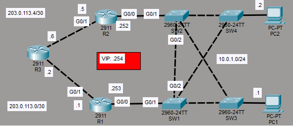

A two-router topology with R1 and R2 both connected to the 10.0.1.0/24 LAN and to an external router (R3) for internet access. PC1 and PC2 sit on the same LAN and use the HSRP virtual IP as their default gateway.

| Device | Role |
|--------|------|
| R1 | HSRP Active Router (10.0.1.253/24) |
| R2 | HSRP Standby Router (10.0.1.252/24) |
| R3 | External Router |
| VIP | HSRP Virtual IP (10.0.1.254/24) |
| PC1 | End host on 10.0.1.0/24 |
| PC2 | End host on 10.0.1.0/24 |

---

## Lab Tasks

---

### Task 1 - Ping external server 8.8.8.8 from PC1/PC2. What is the default gateway configured as?

Before configuring HSRP, both PCs were pinged to 8.8.8.8 to confirm connectivity.

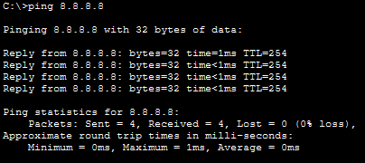

Both pings were successful. The default gateway on both PCs was 10.0.1.253, which is R1's G0/0 physical interface address.

---

### Task 2 - Configure HSRPv2 on R1/R2. Raise R1's priority above the default, lower R2's priority below the default. Enable preemption.

**VIP and version configuration:**

**R1:**
```
R1(config)#int g0/0
R1(config-if)#standby 1 ip 10.0.1.254
R1(config-if)#standby version 2
```

**R2:**
```
R2(config)#int g0/0
R2(config-if)#standby 1 ip 10.0.1.254
R2(config-if)#standby version 2
```

This sets the VIP (Virtual IP address) to 10.0.1.254 on both routers and configures them to use HSRP version 2. The "1" in the command is the HSRP group number. Since this topology does not use VLANs, all HSRP configuration is done under the single group 1.

**Priority and preemption configuration:**

**R1:**
```
R1(config-if)#standby 1 priority 150
R1(config-if)#standby 1 preempt
```

**R2:**
```
R2(config-if)#standby 1 priority 50
```

R1's priority is raised to 150 and R2's is lowered to 50. The default HSRP priority is 100, so R1 will be elected as the active router. Preemption is enabled on R1 so that if it goes down and comes back up, it will reclaim the active role rather than remaining in standby while R2 continues to forward traffic.

**Verification on R1:**

```
R1(config-if)#do show standby
```

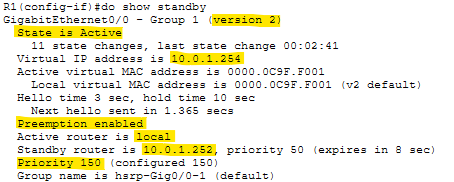

The output confirms HSRP version 2 is running, the VIP is set to 10.0.1.254, preemption is enabled, the active router is local (R1 itself), the standby router is R2 at 10.0.1.252 and the priority is 150.

**Verification on R2:**

```
R2(config-if)#do show standby
```

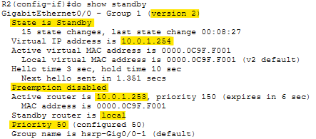

The output confirms the same VIP and version 2 configuration. Preemption is disabled, the active router is 10.0.1.253 (R1's G0/0), standby is local (R2 itself), and the priority is 50.

---

### Task 3 - Configure the VIP as the default gateway of PC1/PC2. Ping 8.8.8.8 from the PCs. Check the PCs' ARP table. What MAC address is mapped to the VIP?

**Default gateway configuration:**

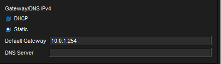

Both PC1 and PC2 had their default gateways updated to 10.0.1.254.

**Ping verification:**

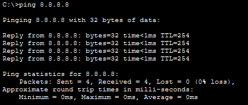

Connectivity to 8.8.8.8 remained successful from both PCs after the gateway change.

**ARP table check:**

```
C:\>arp -a
```

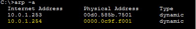

Both PCs show identical ARP tables. 10.0.1.253 is still mapped to R1's physical MAC address from before the gateway change and 10.0.1.254 is mapped to the HSRP virtual MAC address 0000.0c9f.f001. The entry for 10.0.1.253 will eventually age out, leaving only the VIP entry.

The MAC address mapped to the VIP is 0000.0c9f.f001. This is the virtual MAC format used by HSRPv2, where the last three digits represent the group number. Meaning, group 1 provides an ending of "001".

---

### Task 4 - Turn off R1 (save the config first!). After it restarts, ping from PC1 to 8.8.8.8 again. Is R2 used as the default gateway?

**Saving R1's configuration:**

```
R1#copy running-config startup-config
```

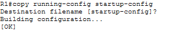

The configuration was saved before powering off the router.

**Powering off R1:**

To power off R1, I switched to the Physical tab in Packet Tracer and toggled the power switch off.

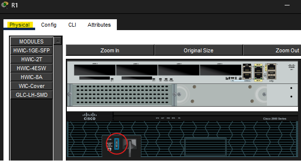

**Ping test with R1 offline:**

```
C:\>ping 8.8.8.8
```

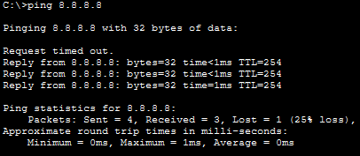

The ping was successful overall, however the first ICMP request timed out. This is consistent with a new ARP process taking place during the VIP swap to R2, suggesting the traffic path changed, which is exactly what should happen when HSRP fails over to R2.

With R1 powered off, R2 stopped receiving Hello messages from it. After some time had passed, R2 promoted itself to the active role. All traffic sent to 10.0.1.254 is now forwarded by R2.

**Verification on R2:**

```
R2(config)#do show standby
```

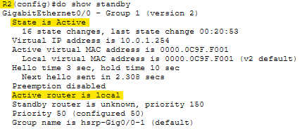

R2 is now the active router, confirming the failover worked correctly.

> Note: Before running `show standby`, R2's CLI had already output the following: `%HSRP-6-STATECHANGE: GigabitEthernet0/0 Grp 1 state Standby -> Active`. The `show standby` confirmed what the log message had already indicated, but it was worth checking the full configuration to see it had updated as expected.

---

### Task 5 - Turn on R1 again. Does it become the active router again?

R1 was powered back on by toggling the physical switch.

```
R1(config)#do show standby
```

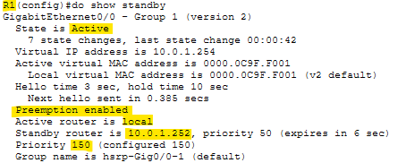

R1 is back to the active role and R2 is once again in standby. This is the result of two things working together: R1's higher priority of 150 versus R2's priority of 50 and preemption being enabled on R1. Without preemption, R2 would have remained active even after R1 came back online.

> Note: On reboot, R1's CLI logged the HSRP state transitions as Init -> Init, then Standby -> Active. The Init state is new to me. I assume that it is the startup state HSRP enters when a router first comes online, used to begin communicating with other HSRP group members before a role is determined.

---

## Verification Summary

| Task | Verified Via |
|------|-------------|
| Initial connectivity | `ping 8.8.8.8` from PC1 and PC2 confirmed successful before HSRP |
| Default gateway pre-HSRP | PC gateway confirmed as 10.0.1.253 (R1's G0/0) |
| HSRP VIP and version on R1 | `show standby` on R1 confirmed VIP 10.0.1.254, version 2 |
| Priority and preemption on R1 | `show standby` on R1 confirmed priority 150, preemption enabled |
| HSRP VIP and version on R2 | `show standby` on R2 confirmed VIP 10.0.1.254, version 2 |
| Priority on R2 | `show standby` on R2 confirmed priority 50, preemption disabled |
| Default gateway update on PCs | Gateway field on PC1 and PC2 set to 10.0.1.254 |
| Connectivity after gateway change | `ping 8.8.8.8` from both PCs successful |
| ARP table and virtual MAC | `arp -a` on both PCs confirmed 0000.0c9f.f001 mapped to VIP |
| Config saved before shutdown | `copy running-config startup-config` confirmed with OK |
| Failover to R2 | First ICMP timeout then successful pings; `show standby` on R2 confirmed Active |
| Preemption on R1 restore | `show standby` on R1 confirmed Active after reboot |

---

## Key Concepts Demonstrated

| Concept | Description |
|---------|-------------|
| **HSRP** | A Cisco proprietary First Hop Redundancy Protocol (FHRP) that allows two or more routers to share a virtual IP and MAC address, providing transparent gateway redundancy for end hosts |
| **Virtual IP (VIP)** | The shared gateway address that end hosts point to. The HSRP active router responds to ARP requests for this address |
| **Active Router** | The router currently forwarding traffic on behalf of the VIP |
| **Standby Router** | The router monitoring the active router and ready to take over if it fails |
| **Priority** | Determines which router becomes active. Higher priority wins. Default is 100 |
| **Preemption** | Allows a higher priority router to reclaim the active role after recovering from a failure. Disabled by default |
| **HSRPv2 Virtual MAC** | Format: 0000.0c9f.f000 + group number. Group 1 produces 0000.0c9f.f001 |
| **Hello / Hold Timer** | HSRP routers send Hello messages every 3 seconds by default. If the hold timer (10 seconds by default) expires without a Hello from the active router, the standby router promotes itself |

---

## Reflection

This lab showed how HSRP provides transparent gateway redundancy without requiring any reconfiguration on end hosts beyond changing their default gateway to the VIP. The failover in Task 4 worked cleanly, with only one dropped ping during the transition which was a sign that the process was successful. It's worth noting that priority alone is not enough for arouterto reclaim the active role after coming back online, preemption also has to be enabled. Additionally, the Init state that appeared in R1's CLI log on reboot was new to me and based on the context it appears to be the startup state HSRP enters before determining its role in the group.

---

*Lab file: `Day_29_Lab_-_HSRP_Configuration.pkt`*
*Jeremy's IT Lab - Day 29 | Independent CCNA Study*
