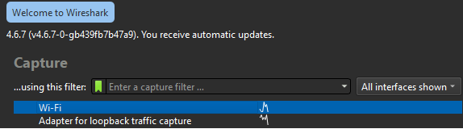
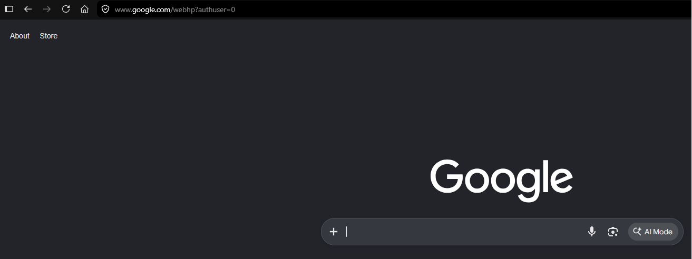
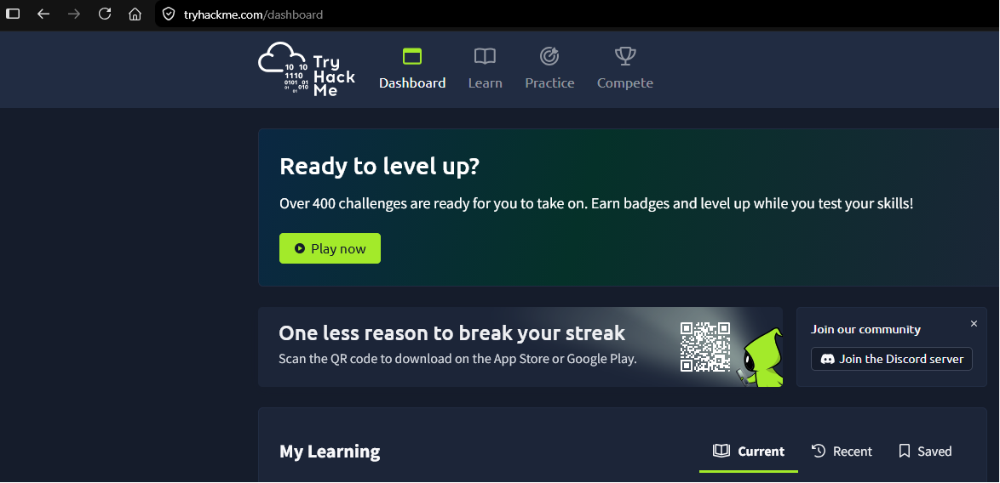
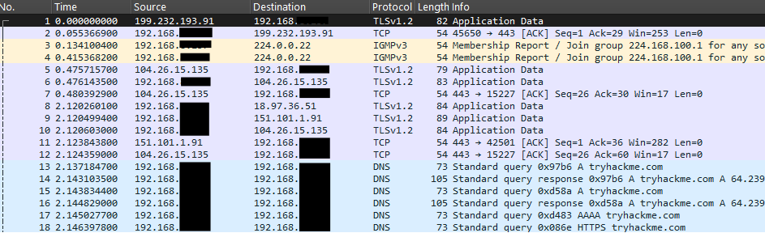
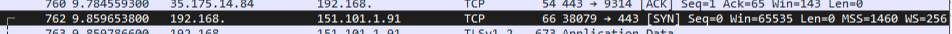
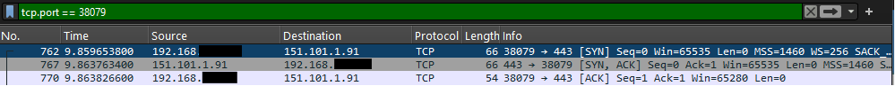
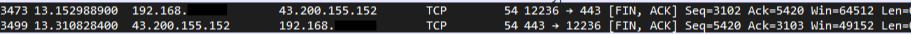

# Lab 30 - TCP Wireshark Analysis

**Platform:** Wireshark  
**Source:** Jeremy's IT Lab - Day 30  
**Category:** Network / Protocol Analysis  
**Difficulty:** Foundational  

---

## Objective

Capture and analyse live network traffic using Wireshark. This lab covers TCP at Layer 4, including identifying and examining a TCP three-way handshake for connection establishment and a four-way handshake for connection termination in real traffic captured from a PC.

---

## Lab Tasks

---

### Task 1 - Use Wireshark to capture network traffic sent and received by your PC

Wireshark was opened and the Wi-Fi interface was selected to begin the capture.

This brought up the packet capture view, showing a live list of all inbound and outbound traffic on the Wi-Fi NIC. The list updates rapidly, capturing a wide variety of protocols and destinations.

---

### Task 2 - Visit some websites

With the capture running, a few websites were visited to generate traffic, including google.com and tryhackme.com.

---

### Task 3 - Stop the Wireshark capture

The capture was stopped, freezing the packet list so no new packets would be added.

---

### Task 4 - Find a TCP three-way handshake (connection establishment)

Wireshark's display filter was set to TCP to narrow down the packet list and locate the beginning of a handshake.

The start of a TCP three-way handshake was found at packet 762, targeting a server at 151.101.1.91 over HTTPS. To make the full exchange easier to follow, the traffic was filtered further by the ephemeral source port my PC had assigned to the session.

This revealed all three packets of the handshake.

**Packet 762 - SYN**

Sent from port 38079 to port 443. Port 38079 is the ephemeral port randomly chosen by my PC to identify and track this specific session and port 443 is the destination HTTPS port on the server. The SYN flag is set, signalling the start of the connection. The sequence number shows as 0, which is the relative value Wireshark displays by default rather than the actual random sequence number in use.

**Packet 767 - SYN, ACK**

The server responds from port 443 back to port 38079, with source and destination IPs reversed. Both the SYN and ACK flags are set, acknowledging the connection request and continuing the handshake. The Ack value is 1, a forward acknowledgement for the next segment the server expects to receive from my PC. These are again relative values shown by Wireshark.

**Packet 770 - ACK**

My PC sends the final part of the handshake with the ACK flag set, confirming the connection is established. The sequence number is 1, matching what the server expected and the Ack value is 1 as a forward acknowledgement for the server's next segment, whose previous sequence number was 0.

---

### Task 5 - Find a TCP four-way handshake (connection termination)

The capture had been stopped before the termination of the most recent session occurred, so this is from a separate session. Packets 3473 and 3499 show the TCP connection termination process. Both packets have the FIN and ACK flags combined in a single message each, which is different to the four separate messages that I expected, which is how I learned this process. 
After researching, this is normal TCP behaviour, as in practice the FIN and ACK messages are combined for efficiency. While the process is still logically a four-way handshake.

This is an HTTPS session being terminated, visible from port 443 and the ephemeral port 12236. The high sequence and acknowledgement numbers indicate a lot of data was exchanged during this session, even accounting for Wireshark's relative value display.

---

## Verification Summary

| Task | Verified Via |
|------|-------------|
| Capture started on Wi-Fi | Wireshark interface list, Wi-Fi selected and capture initiated |
| Websites visited | Google and TryHackMe loaded in browser during active capture |
| Capture stopped | Packet list frozen with no new entries appearing |
| TCP handshake located | Display filter `tcp` applied, SYN packet found at no. 762 targeting 151.101.1.91 |
| Full handshake isolated | Filter `tcp.port == 38079` confirmed packets 762, 767 and 770 as the complete exchange |
| Connection termination found | Packets 3473 and 3499 confirmed FIN, ACK in both directions |

---

## Key Concepts Demonstrated

| Concept | Description |
|---------|-------------|
| **Wireshark** | A network protocol analyser used to capture and inspect traffic in real time |
| **TCP Three-way Handshake** | Connection establishment using SYN, SYN-ACK, and ACK |
| **TCP Four-way Handshake** | Connection termination using FIN and ACK, in practice commonly combined into two FIN, ACK packets for efficiency |
| **SYN** | Synchronise flag, sent to initiate a TCP connection |
| **ACK** | Acknowledgement flag, confirms receipt of the previous segment |
| **FIN** | Finish flag, signals the sender has no more data to send |
| **Ephemeral Port** | A temporary, randomly assigned port used by a client to identify and track a specific session |
| **Relative Sequence Numbers** | Wireshark's default display mode, showing sequence and acknowledgement numbers starting from 0 rather than their true values |
| **Port 443** | Well-known port number for HTTPS |

---

## Reflection

This was a different kind of lab compared to the configuration-heavy ones before it. Seeing TCP handshakes in real captured traffic made the theory a lot more concrete. The most interesting part was finding that the four-way termination handshake appeared as just two FIN, ACK packets rather than four separate messages, which was confusing at first, but a valuable demonstration that logical and practical processes don't always align.

---

*Jeremy's IT Lab - Day 30 | Independent CCNA Study*
