# Lab 31 - IPv6 Configuration (Part 1)

**Platform:** Cisco Packet Tracer  
**Source:** Jeremy's IT Lab - Day 31  
**Category:** Network / Routing  
**Difficulty:** Foundational  

---

## Objective 

Configure IPv6 addressing on a pre-built IPv4 topology to create a dual-stack network. This lab covers enabling IPv6 routing, configuring IPv6 addresses on router interfaces and end hosts, IPv6 address abbreviation rules, link-local addresses and verifying connectivity across both IPv4 and IPv6.

---

## Topology Overview

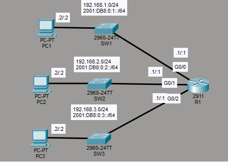

A single router (R1) connects three separate subnets via SW1, SW2 and SW3, each with one PC. IPv4 addressing was pre-configured and IPv6 addresses are added in this lab to create a dual-stack topology.

| Device | Role |
|--------|------|
| R1 | Dual-stack router - gateway for all three subnets |
| SW1 | Access switch for PC1 (192.168.1.0/24, 2001:DB8:0:1::/64) |
| SW2 | Access switch for PC2 (192.168.2.0/24, 2001:DB8:0:2::/64) |
| SW3 | Access switch for PC3 (192.168.3.0/24, 2001:DB8:0:3::/64) |
| PC1 | End host on subnet 1 |
| PC2 | End host on subnet 2 |
| PC3 | End host on subnet 3 |

---

## Lab Tasks

---

### Task 1 - Enable IPv6 routing on R1

```
R1(config)#ipv6 unicast-routing
```

Without this command, R1 would not forward any IPv6 packets even if IPv6 addresses are configured on its interfaces.

---

### Task 2 - Configure the appropriate IPv6 addresses on R1

R1 has three switch-facing interfaces that each need an IPv6 address assigned.

**G0/0:**
```
R1(config)#int g0/0
R1(config-if)#ipv6 address 2001:DB8:0:1::1/64
R1(config-if)#no shutdown
```

**G0/1:**
```
R1(config-if)#int g0/1
R1(config-if)#ipv6 address 2001:DB8:0:2::1/64
R1(config-if)#no shutdown
```

**G0/2:**
```
R1(config-if)#int g0/2
R1(config-if)#ipv6 address 2001:DB8:0:3::1/64
R1(config-if)#no shutdown
```

The `ipv6 address` command follows the same structure as the IPv4 version. Addresses are 128 bits in hexadecimal format and use /x notation for the subnet mask.

The addresses entered above are already in abbreviated form. IPv6 addresses can be shortened by removing the leading 0s within each quartet and any consecutive quartets that are all 0s can be replaced with a double colon (`::`). The double colon can only be used once per address. If there are two non-consecutive groups of all-0 quartets, typically the larger group takes the `::` and the other has its leading 0s removed only.

> Note: As an example, `2001:0000:0000:0000:20A1:0000:0000:32BD` abbreviates to `2001::20A1:0:0:32BD`. The 3 consecutive all-0 quartets are replaced with `::`, and the leading 0s are removed from the remaining quartets.

---

### Task 3 - Confirm your configurations. What IPv6 addresses are present on each interface?

```
R1(config-if)#do show ipv6 interface brief
```

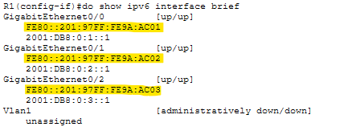

The output shows two addresses per interface. The addresses configured in Task 2 are confirmed on G0/0, G0/1 and G0/2. The highlighted addresses were not manually configured and are called 'Link-Local Addresses'. I am not too familiar with this type of address yet, but I do know that they are automatically assigned to an interface when an IPv6 address is configured and IPv6 is enabled on that interface.

---

### Task 4 - Configure the appropriate IPv6 addresses on each PC. Configure the correct default gateway.

**PC1:**

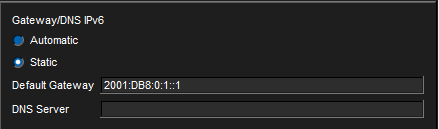

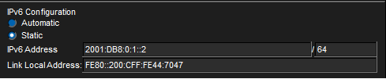

> Note: The PC configuration screen also displays the automatically assigned link-local address for the PC as well.

**PC2:**

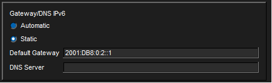

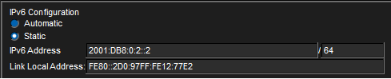

**PC3:**

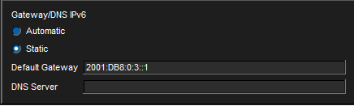

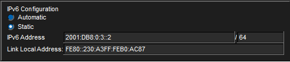

---

### Task 5 - Attempt to ping between the PCs (IPv4 and IPv6)

**PC1 to default gateway (IPv6):**

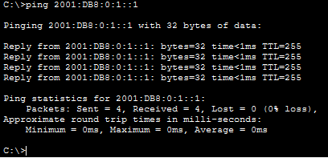

PC1 successfully reached R1's G0/0 interface over IPv6.

**PC1 to PC2 (IPv6):**

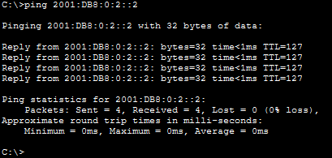

PC1 successfully reached PC2 over IPv6, confirming inter-subnet routing is working correctly.

**PC1 to PC3 (IPv4):**

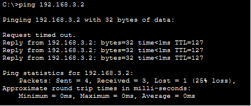

The first packet timed out, which was initially worrying, however this was just the ARP process completing before the first reply could come back. The remaining three replies were successful, confirming IPv4 routing is also working. 

This means the topology is running both IPv4 and IPv6 simultaneously, which must be what a dual-stack network is. Both protocols are active at the same time, perhaps as a form of redundancy? although more likely serving as a middle state for transtioning from IPv4 to IPv6.

---

## Verification Summary

| Task | Verified Via |
|------|-------------|
| IPv6 routing enabled | `ipv6 unicast-routing` applied on R1 |
| IPv6 addresses on R1 | `show ipv6 interface brief` confirmed all three interfaces up with correct addresses |
| Link-local addresses | `show ipv6 interface brief` showed auto-assigned link-local addresses on each interface |
| PC IPv6 addresses and gateways | Configuration screens confirmed on PC1, PC2 and PC3 |
| IPv6 inter-subnet routing | PC1 ping to PC2 at 2001:DB8:0:2::2 successful |
| IPv4 still functional | PC1 ping to PC3 at 192.168.3.2 successful |

---

## Key Concepts Demonstrated

| Concept | Description |
|---------|-------------|
| **ipv6 unicast-routing** | Enables IPv6 routing on a Cisco router, required before the router will forward IPv6 packets |
| **IPv6 Addressing** | 128-bit hexadecimal addresses using /x prefix notation for the subnet mask |
| **IPv6 Abbreviation** | Leading zeros within quartets can be removed, consecutive all-zero quartets can be replaced with `::`, which can only be done once per address |
| **Link-Local Address** | Automatically assigned when IPv6 is enabled on an interface |
| **show ipv6 interface brief** | IPv6 equivalent of `show ip interface brief`, displays all IPv6 addresses assigned to each interface |
| **Dual-Stack** | Running IPv4 and IPv6 simultaneously on the same network |

---

## Reflection

This was a clean introductory IPv6 lab that built directly on my IPv4 knowledge, with most commands following the same structure as the IPv4 versions. The most useful observation was during the testing of Task 5, where pinging PC3 over IPv4 while the rest of the pings were over IPv6 made the dual-stack concept concrete. Both protocols were active at the same time on the same topology, which also made me think about why dual-stack exists in the first place.

---

*Lab file: `Day_31_Lab_-_IPv6_Configuration__Part_1_.pkt`*
*Jeremy's IT Lab - Day 31 | Independent CCNA Study*
