# Lab 32 - IPv6 Configuration (Part 2)

**Platform:** Cisco Packet Tracer  
**Source:** Jeremy's IT Lab - Day 32  
**Category:** Network / Routing  
**Difficulty:** Intermediate  

---

## Objective

Extend IPv6 configuration across a two-router topology using EUI-64 addressing, link-local only interfaces and IPv6 static routes. This lab covers manual EUI-64 interface ID calculation, the `ipv6 enable` command, IPv6 static route configuration and testing IPv6 routes through ping.

---

## Topology Overview

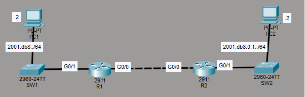

A two-router topology with R1 and R2 connected back-to-back via their G0/0 interfaces. PC1 connects to R1 through SW1 on the 2001:DB8::/64 subnet and PC2 connects to R2 through SW2 on the 2001:DB8:0:1::/64 subnet. IPv4 is pre-configured and IPv6 is added throughout this lab.

| Device | Role |
|--------|------|
| R1 | Router - G0/1 connects to SW1/PC1 (2001:DB8::/64), G0/0 links to R2 |
| R2 | Router - G0/1 connects to SW2/PC2 (2001:DB8:0:1::/64), G0/0 links to R1 |
| SW1 | Access switch for PC1 |
| SW2 | Access switch for PC2 |
| PC1 | End host on 2001:DB8::/64 |
| PC2 | End host on 2001:DB8:0:1::/64 |

---

## Lab Tasks

---

### Task 1 - Use EUI-64 to configure IPv6 addresses on G0/1 of R1 and R2. Before configuring the addresses, calculate the EUI-64 interface ID that will be generated on each interface.

The task requires the EUI-64 interface IDs to be calculated manually before configuring.   
EUI-64 generates a 64-bit interface identifier from a 48-bit MAC address in three steps. This process is normally done automatically by routers.

**R1 - G0/1:**

First, the MAC addresses must be checked. This is done using:
```
R1(config)#do show interfaces g0/1
```

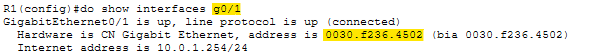

G0/1 MAC address: `0030.f236.4502`

Now the EUI-64 begins.

**Step 1** - Divide the MAC address in half
Dividing in half gives `0030.f2 | 36.4502`.

**Step 2** - Insert hexadecimal `FFFE` into the middle of the address
Inserting FFFE gives `0030:f2FF:FE36:4502`.

**Step 3** - Invert the 7th bit
`0030:f2FF:FE36:4502`
Each digit is 4 bits, so `00` = 8 bits, meaning the 7th bit is in the second digit `0`

> Note: The 7th bit is also known as the U/L bit, as it identifies whether the address was universally or locally administered

Converting `0x0` to binary gives `0b0000`; inverting the 7th bit changes it to `0b0010`, which converts back to `0x2`. 

The resulting EUI-64 interface ID is `0230:f2FF:FE36:4502`.

**R1 - G0/0:**

First, check the MAC address:
```
R1(config)#do show interfaces g0/0
```

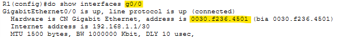

MAC address: `0030.f236.4501`

**Step 1** - Divide the MAC address in half
Dividing in half gives `0030.f2 | 36.4501`.

**Step 2** - Insert hexadecimal `FFFE` into the middle of the address
Inserting FFFE gives `0030:f2FF:FE36:4501`

**Step 3** - Invert the 7th bit
The 7th bit falls in the same position as G0/1. The process is the same.

Resulting EUI-64 interface ID is `0230:f2FF:FE36:4501`.

**R2 - G0/0:**

First, check the MAC address:
```
R2(config)#do show interfaces g0/0
```

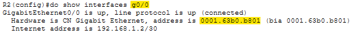

MAC address: `0001.63b0.b801`

**Step 1** - Divide the MAC address in half
Dividing in half gives `0001.63 | b0.b801`. 

**Step 2** - Insert hexadecimal `FFFE` into the middle of the address
Inserting FFFE gives `0001:63FF:FEb0:b801`.

**Step 3** - Invert the 7th bit
The 7th bit again falls in the second digit, which is `0`, so the result is the same `0x2`.  

The resulting EUI-64 interface ID is `0201:63FF:FEb0:b801`.

**R2 - G0/1:**

First, check the MAC address:
```
R2(config)#do show interfaces g0/1
```

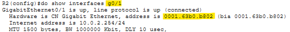

MAC address: `0001.63b0.b802`

**Step 1** - Divide the MAC address in half
Dividing in half gives `0001.63 | b0.b802`.

**Step 2** - Insert hexadecimal `FFFE` into the middle of the address
Inserting FFFE gives `0001:63FF:FEb0:b802`

**Step 3** - Invert the 7th bit
The 7th bit falls in the same position as the others, on `0`. 

The resulting EUI-64 interface ID is `0201:63FF:FEb0:b802`.

> Note: After completing all four calculations, I re-read the task and noticed it only required the calculation for G0/1 on each router. So the G0/0 calculations were unnecessary extra work, though useful practice regardless.


**Configuring IPv6 Addresses on the G0/1 interfaces of R1/2**


**Configuring G0/1 with EUI-64:**

**R1:**
```
R1(config)#int g0/1
R1(config-if)#ipv6 address 2001:DB8::/64 eui-64
```

This command configures the IPv6 address by specifying only the 64-bit global routing prefix and prefix length, leaving EUI-64 to generate the interface identifier automatically.

```
R1(config-if)#do show ipv6 interface brief
```

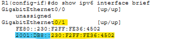

The EUI-64 generated interface identifier on G0/1 matches the manual calculation, with the leading zero of `0230` dropped, resulting in `230` in the final address.

**R2:**
```
R2(config)#int g0/1
R2(config-if)#ipv6 address 2001:DB8:0:1::/64 eui-64
```

This prefix includes a subnet identifier in addition to the global routing prefix.

```
R2(config-if)#do show ipv6 interface brief
```

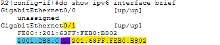

The EUI-64 interface identifier on G0/1 also matches the manual calculation, again with the leading zero removed.

---

### Task 2 - Configure the appropriate IPv6 addresses and default gateways on PC1 and PC2

**PC1:**

IPv6 address: `2001:DB8::2/64`  
Default gateway: `2001:DB8::230:F2FF:FE36:4502` (R1's G0/1 EUI-64 address)  

**PC2:**

IPv6 address: `2001:DB8:0:1::2/64`  
Default gateway: `2001:DB8:0:1:201:63FF:FEB0:B802` (R2's G0/1 EUI-64 address)  

> Note: A /64 prefix length is used as that is the standard expected prefix length for IPv6.

---

### Task 3 - Enable IPv6 on G0/0 of R1 and R2 without explicitly configuring an IPv6 address

```
Rx(config-if)#ipv6 enable
```

This activates IPv6 on an interface and automatically generates a link-local address using EUI-64, without assigning a global unicast address. Link-local addresses always begin with the hexadecimal prefix `FE80`.

**R1:**
```
R1(config)#int g0/0
R1(config-if)#ipv6 enable
```

```
R1(config-if)#do show ipv6 interface brief
```

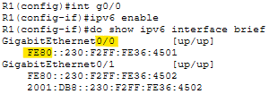

G0/0 now shows IPv6 as up with only a link-local address, while G0/1 continues to show both a link-local and a global unicast address.

**R2:**
```
R2(config)#int g0/0
R2(config-if)#ipv6 enable
```

```
R2(config-if)#do show ipv6 interface brief
```

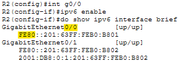

The same result occurred on R2. G0/0 has a link-local address only, and G0/1 has both.

---

### Task 4 - Configure static routes on R1 and R2 to enable PC1 to ping PC2. Use the 'ipv6 route' command with '?' to learn how to use the command.

IPv6 static routing was new territory, so the `?` system was used to help me figure out the commands.

```
R1(config)#ipv6 route ?
```

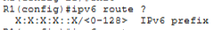

The output indicated the first argument is an IPv6 prefix with a prefix length. I assumed it was for the destination prefix.  
A second `?` was used after entering the destination to find the next portion of the command.

```
R1(config)#ipv6 route 2001:DB8:0:1::/64 ?
```

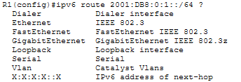

This confused me at first, but after thinking about it, I assumed I needed to specify the next hop. Whether it be the gigabit ethernet interface or the IPv6 address of the next hop itself.  
The link-local address of R2's G0/0 was tried first as the next hop:

```
R1(config)#ipv6 route 2001:DB8:0:1::/64 FE80::201:63FF:FEB0:B801
```

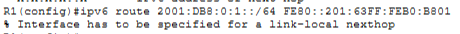

The CLI rejected this with "Interface has to be specified for a link-local nexthop". So I tried the command with the exit interface specified instead.
> Note: This was the catalyst for later issues

```
R1(config)#ipv6 route 2001:DB8:0:1::/64 g0/0
```

No error appeared, so the routing table was checked. 

```
R1(config)#do show ip route
```

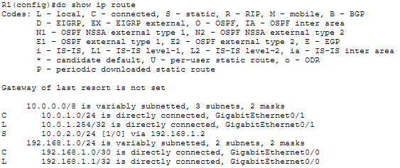

This was the wrong command as I didn't realise IPv6 had a separate command for the routing table.  
The correct command for IPv6 is:

```
R1(config)#do show ipv6 route
```

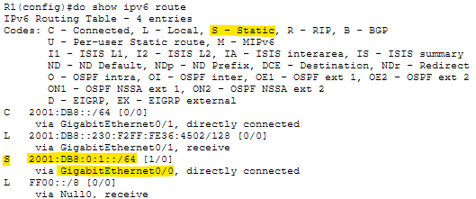

The static route appeared in R1's IPv6 routing table. 

I then needed to add the reverse route to R2's IPv6 routing table:

```
R2(config)#ipv6 route 2001:DB8::/64 g0/0
```

```
R2(config)#do show ipv6 route
```

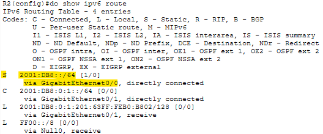

The route was confirmed on R2.   

The ping was then attempted from PC1:

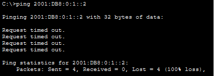

It failed, all four ICMP requests timed out.   

I checked simulation mode in Packet Tracer, it showed the packet being dropped at R1. 

To troubleshoot, I first thought that perhaps IPv6 unicast routing had not been enabled on either router, as this matched perfectly to the symptoms of the issue.   
So this was tried first:

```
R1(config)#ipv6 unicast-routing
R2(config)#ipv6 unicast-routing
```

The ping was tried again and still failed. All the interfaces were up/up, IPv6 addresses configured, routes were in the routing table and IPv6 unicast routing was made sure to be active.

I was really stuck here, so I decided to watch Jeremy's video demonstration to see if I could find the solution.

After reviewing Jeremy's lab demonstration, the issue became clear. When the CLI rejected the link-local address as the next hop, I took this as replacing the address with just the exit-interface, which would have worked with IPv4 (not that it has link-local IPs). However the correct command was to specify both the exit interface and the link-local address together, not to replace one with the other.   
The routes were corrected:

```
R1(config)#ipv6 route 2001:DB8:0:1::/64 g0/0 FE80::201:63FF:FEB0:B801
R2(config)#ipv6 route 2001:DB8::/64 g0/0 FE80::230:F2FF:FE36:4501
```

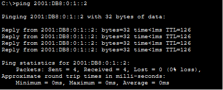

The ping was successful immediately after applying the corrected routes.

---

## Verification Summary

| Task | Verified Via |
|------|-------------|
| EUI-64 manual calculations | Results compared against `show ipv6 interface brief` output after configuration |
| R1 G0/1 EUI-64 address | `show ipv6 interface brief` on R1 confirmed address matched manual calculation |
| R2 G0/1 EUI-64 address | `show ipv6 interface brief` on R2 confirmed address matched manual calculation |
| IPv6 enable on R1 G0/0 | `show ipv6 interface brief` confirmed link-local address only on G0/0 |
| IPv6 enable on R2 G0/0 | `show ipv6 interface brief` confirmed link-local address only on G0/0 |
| Static route on R1 | `show ipv6 route` confirmed 2001:DB8:0:1::/64 via G0/0 |
| Static route on R2 | `show ipv6 route` confirmed 2001:DB8::/64 via G0/0 |
| End-to-end connectivity | PC1 ping to 2001:DB8:0:1::2 successful after correcting static routes |

---

## Key Concepts Demonstrated

| Concept | Description |
|---------|-------------|
| **EUI-64** | Generates a 64-bit IPv6 interface identifier from a 48-bit MAC address by splitting the MAC in half, inserting FFFE and inverting the 7th bit |
| **U/L Bit** | The 7th bit in an EUI-64 address, inverted to indicate the interface ID was locally generated |
| **ipv6 address eui-64** | Configures an IPv6 address using only the prefix, with the interface ID generated automatically via EUI-64 |
| **ipv6 enable** | Enables IPv6 on an interface and generates a link-local address without specifying an address |
| **Link-Local Address** | An IPv6 address beginning with FE80, scoped to the local link and automatically generated on any IPv6-enabled interface |
| **IPv6 Static Route** | Configured with `ipv6 route [prefix] [exit-interface] [link-local next-hop]`, a link-local next hop needs both the exit interface and the address to be specified |
| **show ipv6 route** | Displays the IPv6 routing table, equivalent to `show ip route` for IPv4 |
| **ipv6 unicast-routing** | Required on a router before it will forward IPv6 packets between interfaces |

---

## Reflection

This was a more involved IPv6 lab than Part 1, with the manual EUI-64 calculations and static routing covering new ground. The most instructive part was the static route troubleshooting in Task 4, where the CLI error about specifying an interface for a link-local next hop was misinterpreted as meaning the interface should replace the address entirely. The correct command requires both together, which only became clear after the ping failed and reviewing the lab demonstration. It was a simple mistake to make given I have no experience with IPv6 routing, however I'm proud of myself for nearly getting the command correct first try, as I applied my knowledge of IPv4 routing and almost pieced it together without demonstration. This lab was a good practical lesson in what can go wrong and shows how IPv6 is similar yet quite a bit different from IPv4.

---

*Lab file: `Day_32_Lab_-_IPv6_Configuration__Part_2_.pkt`*
*Jeremy's IT Lab - Day 32 | Independent CCNA Study*
