# Lab 33 - IPv6 Static Routes

**Platform:** Cisco Packet Tracer	  
**Source:** Jeremy's IT Lab - Day 33	  
**Category:** Network / Routing	    
**Difficulty:** Intermediate  

---

## Objective

Configure IPv6 static routes across a three-router topology to allow PC1 and PC2 to communicate, with a floating backup path via a secondary router. This lab covers SLAAC address assignment, the NDP Router Solicitation and Advertisement process, fully specified IPv6 static routes, floating static routes over serial links using link-local next hops and failover verification.

---

## Topology Overview

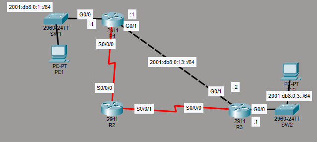

A three-router topology with R1 and R3 connected directly via GigabitEthernet as the primary path and both connected to R2 via serial links as the backup path. PC1 sits behind R1 on SW1 and PC2 sits behind R3 on SW2. IPv6 addresses are pre-configured on the routers and serial connections use link-local addresses only.

| Device | Role |
|--------|------|
| R1 | Router - connects to SW1/PC1 (2001:db8:0:1::/64), primary link to R3 via G0/1, backup serial link to R2 |
| R2 | Backup router - serial links to R1 and R3 only |
| R3 | Router - connects to SW2/PC2 (2001:db8:0:3::/64), primary link to R1 via G0/1, backup serial link to R2 |
| SW1 | Access switch for PC1 |
| SW2 | Access switch for PC2 |
| PC1 | End host on 2001:db8:0:1::/64 |
| PC2 | End host on 2001:db8:0:3::/64 |

---

## Lab Tasks

---

### Task 1 - Enable IPv6 routing on each router

```
Rx(config)#ipv6 unicast-routing
```

This was applied to R1, R2 and R3. Without it, the routers will not forward any IPv6 packets even with IPv6 addresses configured.

---

### Task 2 - Use SLAAC to configure IPv6 addresses on the PCs

SLAAC (Stateless Address Auto-Configuration) is an IPv6 technology that allows IPv6 devices to automatically obtain IPv6 addresses using NDP (Neighbour Discovery Protocol). It works similarly to IPv4 DHCP, although without needing a server.

To enable SLAAC on each PC in Packet Tracer, in the config tab, under the NIC settings (FastEthernet0 for both) the IPv6 configuration was changed from Static to Automatic. Each PC then automatically received a unicast address and a link-local address.

**PC1:**

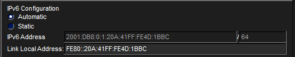

**PC2:**

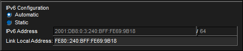

The addresses were generated using the EUI-64 algorithm, which SLAAC uses after learning the local prefix through NDP. When a host comes online it sends an RS (Router Solicitation) to `FF02::2`, the all-routers multicast address, requesting that any routers on the link identify themselves. Routers respond with an RA (Router Advertisement) to `FF02::1`, the all-nodes multicast address, announcing their presence and advertising the local network prefix. SLAAC takes that prefix from the RA and combines it with an EUI-64 generated interface ID from the PC's MAC address to produce the full 128-bit address.

> Note: Both PCs have received global unicast addresses rather than unique local addresses. Typically in a real network, unique local addresses would be used in this scenario unless explicitly needing to be accessible from the internet. However, this is just a lab exercise, so I assume global unicast addresses are used for the sake of practice.

---

### Task 3 - Configure static routes on the routers to allow PC1 and PC2 to ping each other. The path via R2 should be used only as a backup path.

The task asks to configure static routes on each router to allow PC1 and PC2 to ping each other. It also asks that the path via R2 be only used as a backup path. For the path via R2 to act as a backup, the AD value must be configured higher than the route between R1 and R3, making it a floating static route.

Firstly, lets configure the routes between R1 and R3

**Main routes (R1 to R3 via GigabitEthernet):**

```
R1(config)#ipv6 route 2001:db8:0:3::/64 g0/1 2001:db8:0:13::2
```

```
R3(config)#ipv6 route 2001:db8:0:1::/64 g0/1 2001:db8:0:13::1
```

Both routes are fully specified, including both the exit interface and the next-hop ip. This covers the main route between PC1 and PC2 via the direct GigabitEthernet link between R1 and R3.

**Ping Test:**

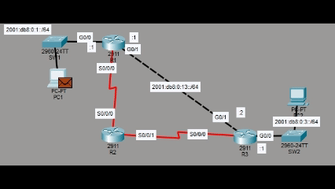

As shown in the gif, the ICMP Echo Request from PC1 and the ICMP Echo Reply from PC2 are both able to reach their destination via the IPv6 static route configured, with all 4 packets succeeding.

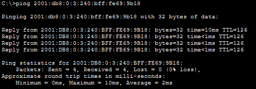

This confirms the main path between R1 and R3 is working correctly.

**Floating Static Route Configuration:**

The lab states that the serial connections use link-local addresses only. As learned first hand in the previous lab, a fully specified route is required when using a link-local next hop, meaning both the exit interface and the link-local address must be specified together. 

In order to configure the backup routes, the link-local addresses on each router's serial interfaces need to be found. I did so by using:

```
Rx#show ipv6 interface brief
```

**R1:**

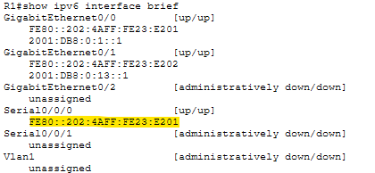

S0/0/0: `FE80::202:4AFF:FE23:E201`

**R2:**

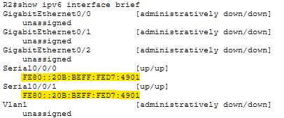

S0/0/0 and S0/0/1: both showing `FE80::20B:BEFF:FED7:4901`

> Note: R2 has the same link-local address on both serial interfaces. This must be one of the reasons why an exit interface MUST be specified in the IPv6 route command when using link-local next hops. Without it, the router would have no way to determine which interface to use when both share the same link-local address. Probably very important in scenarios with dynamic routing protocols like OSPF.

**R3:**

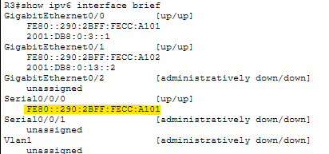

S0/0/0: `FE80::290:2BFF:FECC:A101`

Now that the link-local addresses of each router's serial interfaces has been found, we can configure the floating static route.

For the backup route to remain inactive while the main route is available, an AD value of 2 is set. The default AD for a static route is 1, so a value of 2 makes the backup to float just above it.

**R1:**
```
R1(config)#ipv6 route 2001:db8:0:3::/64 s0/0/0 fe80::20b:beff:fed7:4901 2
```

**R2:**
```
R2(config)#ipv6 route 2001:db8:0:3::/64 s0/0/1 fe80::290:2bff:fecc:a101
R2(config)#ipv6 route 2001:db8:0:1::/64 s0/0/0 fe80::202:4aff:fe23:e201
```

R2's routes do not need the AD value specified as they are not competing with any other routes. They will only be used when R1 and R3 deem the backup route necessary.

**R3:**
```
R3(config)#ipv6 route 2001:db8:0:1::/64 s0/0/0 fe80::20b:beff:fed7:4901 2
```

**Verification:**

```
R1#show ipv6 route
```

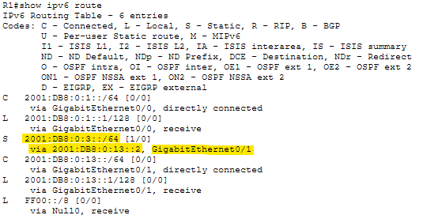

```
R3#show ipv6 route
```

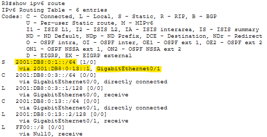

Both routing tables show only the main route via GigabitEthernet0/1, confirming the floating backup routes are correctly sitting outside the active routing table.

**Failover test:**

To verify that the backup route does indeed work and automatically replaces the main route when it cannot be used, I shutdown R1's G0/1 interface to simulate the primary path going down:

```
R1(config)#int g0/1
R1(config-if)#shutdown
```

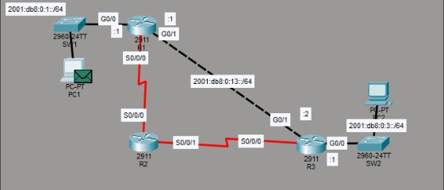

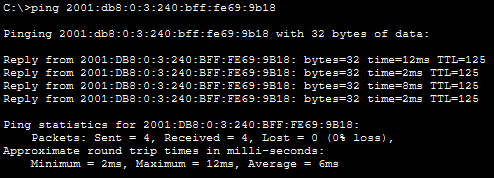

All ICMP messages reached their destinations via the backup path through R2, confirming the floating route is working correctly.

```
R1#show ipv6 route
```

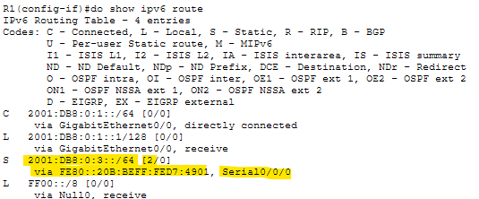

The backup route is now visible in R1's routing table with an AD of 2. G0/1 was then re-enabled:

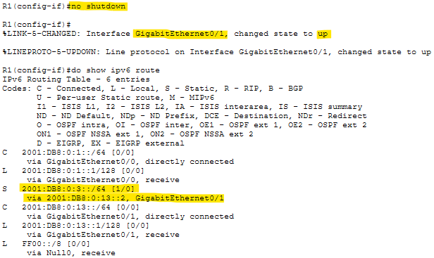

The main route immediately returned to the routing table and the floating route dropped out again, confirming the full floating static route behaviour is working as expected.

---

## Verification Summary

| Task | Verified Via |
|------|-------------|
| IPv6 routing enabled | `ipv6 unicast-routing` applied on R1, R2 and R3 |
| SLAAC on PC1 | IPv6 configuration set to Automatic, global unicast and link-local address confirmed |
| SLAAC on PC2 | IPv6 configuration set to Automatic, global unicast and link-local address confirmed |
| Main route R1 | `show ipv6 route` confirmed 2001:db8:0:3::/64 via GigabitEthernet0/1 |
| Main route R3 | `show ipv6 route` confirmed 2001:db8:0:1::/64 via GigabitEthernet0/1 |
| Initial ping test | PC1 ping to PC2 successful via main route |
| Floating routes not in table | `show ipv6 route` on R1 and R3 confirmed backup routes absent while main route active |
| Failover to backup route | Ping successful via R2 after G0/1 shutdown, confirmed using simulation mode |
| Backup route visible in table | `show ipv6 route` on R1 confirmed AD 2 route via S0/0/0 after G0/1 shutdown |
| Main route restored | `no shutdown` on G0/1 restored main route and removed backup from routing table |

---

## Key Concepts Demonstrated

| Concept | Description |
|---------|-------------|
| **SLAAC** | Stateless Address Auto-Configuration, allows IPv6 hosts to self-assign addresses using NDP without needing a server |
| **NDP** | Neighbour Discovery Protocol, the IPv6 equivalent of ARP with additional functions including prefix advertisement |
| **Router Solicitation (RS)** | Sent by a host to `FF02::2` to request router information from any routers on the local link |
| **Router Advertisement (RA)** | Sent by a router to `FF02::1` to advertise its presence and the local network prefix |
| **Fully Specified IPv6 Route** | An IPv6 static route that includes both an exit interface and a next-hop ip, required when the next hop is a link-local address |
| **IPv6 Floating Static Route** | A static route configured with a higher AD than the primary route, keeping it out of the routing table until the primary route fails |
| **ipv6 unicast-routing** | Enables IPv6 packet forwarding on a Cisco router |
| **show ipv6 route** | Displays the IPv6 routing table, confirming which routes are active |

---

## Reflection

This lab tied together several IPv6 concepts from the previous two labs into a more complete topology. The most interesting part was discovering that R2 had the same link-local address assigned to both of its serial interfaces, which gave insight into why specifying an exit interface is necessary when using link-local next hops in IPv6 static routes. The SLAAC process was also straightforward to configure, it was a good example of how IPv6 handles things a bit more efficiently than IPv4, which relies on dedicated protocols (ARP) and servers (DHCP).

---

*Lab file: `Day_33_Lab_-_IPv6_Static_Routes.pkt`*	  
*Jeremy's IT Lab - Day 33 | Independent CCNA Study*
