# Lab 34 - Standard ACLs  

**Platform:** Cisco Packet Tracer	  
**Source:** Jeremy's IT Lab - Day 34	  
**Category:** Network / Security	  
**Difficulty:** Intermediate  

---

## Objective

Configure OSPF between two routers and implement standard ACLs to enforce four separate network access policies. This lab covers OSPF verification, standard numbered and named ACLs, ACL placement relative to the destination, wildcard masks, implicit deny behaviour and verifying ACL enforcement through ping tests.

---

## Topology Overview

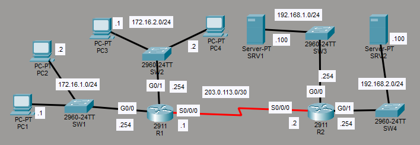

Two routers connected via a serial link, with R1 serving two subnets on its LAN interfaces and R2 serving two server subnets. Four PCs sit behind R1 and two servers sit behind R2. OSPF is to be configured to provide full connectivity before ACLs are applied to restrict specific traffic flows.

| Device | Role |
|--------|------|
| R1 | Internal router - G0/0 (172.16.1.0/24), G0/1 (172.16.2.0/24), S0/0/0 to R2 |
| R2 | Internal router - G0/0 (192.168.1.0/24), G0/1 (192.168.2.0/24), S0/0/0 to R1 |
| SW1 | Access switch for PC1 and PC2 (172.16.1.0/24) |
| SW2 | Access switch for PC3 and PC4 (172.16.2.0/24) |
| SW3 | Access switch for SRV1 (192.168.1.0/24) |
| SW4 | Access switch for SRV2 (192.168.2.0/24) |
| PC1 | End host - 172.16.1.1 |
| PC2 | End host - 172.16.1.2 |
| PC3 | End host - 172.16.2.1 |
| PC4 | End host - 172.16.2.2 |
| SRV1 | Server - 192.168.1.100 |
| SRV2 | Server - 192.168.2.100 |

---

## Lab Tasks

---

### Task 1 - Configure OSPF on R1 and R2 to allow full connectivity between the PCs and servers

OSPF was enabled directly on each interface, which is my preferred method over using network commands.

**R1:**
```
R1(config)#router ospf 1
R1(config-router)#int range g0/0-1
R1(config-if-range)#ip ospf 1 area 0
R1(config-if-range)#int s0/0/0
R1(config-if)#ip ospf 1 area 0
```

The `int range g0/0-1` command configures both GigabitEthernet interfaces together in a single step rather than entering each one separately.

**R2:**
```
R2(config)#router ospf 1
R2(config-router)#int range g0/0-1
R2(config-if-range)#ip ospf 1 area 0
R2(config-if-range)#int s0/0/0
R2(config-if)#ip ospf 1 area 0
```

Immediately after OSPF was enabled on R2's serial interface, the CLI confirmed a new adjacency had formed with R1.

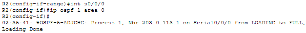

**Verifying OSPF is enabled on each interface:**

```
Rx(config-if)#do show ip ospf interface brief
```

**R1:**

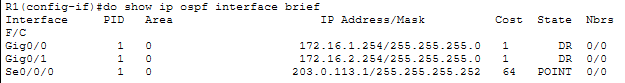

**R2:**

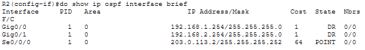

Both routers have OSPF correctly enabled on their interfaces.

**Verifying routes are being shared:**

```
Rx(config-if)#do show ip route
```

**R1:**

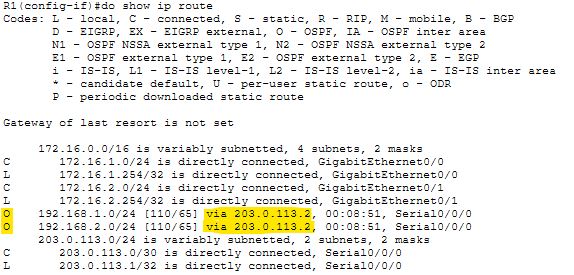

**R2:**

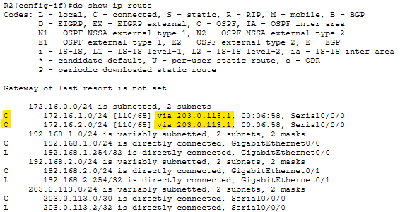

Both routers are receiving OSPF routes for networks on the other side of the serial link, confirming full connectivity between the two.

---

### Task 2 - Configure standard numbered ACLs on R1 and standard named ACLs on R2 to fulfill the following network policies

Standard ACLs should be placed as close to the destination as possible. Policies restricting access to R2's server subnets are configured on R2 as named ACLs and policies restricting traffic between R1's LAN subnets are configured on R1 as numbered ACLs.

---

**Named ACL #1 - Only PC1 and PC3 can access 192.168.1.0/24**

This ACL is placed on R2 as it is closest to the destination subnet. A standard named ACL is created first using:

```
R2(config)#ip access-list standard TO_192.168.1.0/24
```
This both creates the named ACL and enters into the standard named ACL config mode, allowing you to configure this ACL further

PC1 and PC3 are then permitted:

```
R2(config-std-nacl)#permit 172.16.1.1
R2(config-std-nacl)#permit 172.16.2.1
```

No wildcard mask is needed for these entries. When left blank, the router assumes it is a /32 mask, interpreting it as if adding `0.0.0.0`. No "deny all" is needed as all ACLs include an implicit deny at the end that blocks all unmatched traffic.

The ACL is applied outbound on R2's G0/0, filtering traffic heading into the 192.168.1.0/24 network:

```
R2(config-std-nacl)#int g0/0
R2(config-if)#ip access-group TO_192.168.1.0/24 out
```

---

**Named ACL #2 - Hosts in 172.16.2.0/24 cannot access 192.168.2.0/24**

```
R2(config-if)#ip access-list standard TO_192.168.2.0/24
R2(config-std-nacl)#deny 172.168.2.0 0.0.0.255
R2(config-std-nacl)#permit any
```
> Note: This is incorrect, I used the wrong IP

After starting the next ACE, I noticed I made a mistake on this ACL. The deny entry used `172.168.2.0` instead of the correct `172.16.2.0`. Luckily I caught this error, in a real network this could become a major issue, as the intended subnet would not be blocked at all. The ACL was deleted and re-created with the correct address:

```
R2(config)#no ip access-list standard TO_192.168.2.0/24
R2(config)#ip access-list standard TO_192.168.2.0/24
R2(config-std-nacl)#deny 172.16.2.0 0.0.0.255
R2(config-std-nacl)#permit any
```

> Note: The `permit any` entry is required here to counteract the implicit deny, ensuring all other hosts can still reach 192.168.2.0/24.

The ACL is applied outbound on G0/1:

```
R2(config-std-nacl)#int g0/1
R2(config-if)#ip access-group TO_192.168.2.0/24 out
```

A ping test from PC4 to SRV2 was used to confirm the corrected ACL was working:

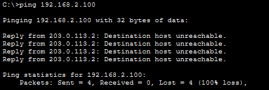

---

**Numbered ACL #1 - 172.16.1.0/24 cannot access 172.16.2.0/24**

This ACL is placed on R1 as it is closest to the destination. As a numbered ACL, each entry in the ACL is configured from global config mode :

```
R1(config)#access-list 1 deny 172.16.1.0 0.0.0.255
R1(config)#access-list 1 permit any
R1(config)#access-list 1 remark ## BLOCK 172.16.1.0/24 ##
```

I added a `remark` as numbered ACLs are less descriptive than named ones, so a short comment helps identify the ACL's purpose when reviewing the running config.

> Note: The biggest difference between numbered and named ACLs beyond the identifier itself is that numbered ACLs are configured entirely from global config mode, while named ACLs entering a specific config mode. However, both are applied to interfaces the same way using `ip access-group`.

The ACL is applied outbound on R1's G0/1, filtering traffic being forwarded into the 172.16.2.0/24 network:

```
R1(config)#int g0/1
R1(config-if)#ip access-group 1 out
```

---

**Numbered ACL #2 - 172.16.2.0/24 cannot access 172.16.1.0/24**

```
R1(config)#access-list 2 deny 172.16.2.0 0.0.0.255
R1(config)#access-list 2 permit any
R1(config)#access-list 2 remark ## BLOCK 172.16.2.0/24 ##
```

Applied outbound on R1's G0/0, filtering traffic heading into the 172.16.1.0/24 network:

```
R1(config)#int g0/0
R1(config-if)#ip access-group 2 out
```

---

**Verification:**

The full ACL configurations were checked on each router:

```
Rx(config)#do show access-lists
```

**R1:**

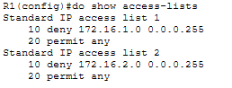

**R2:**

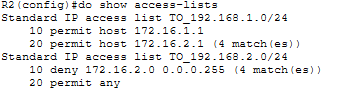

Both routers show the correct ACL entries in the correct order. 

To verify each interface had the correct ACL applied using `show ip interface`:

**R1 G0/0:**

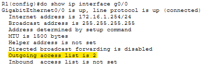

**R1 G0/1:**

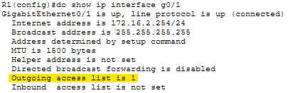

**R2 G0/0:**

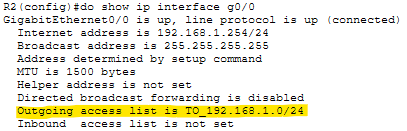

**R2 G0/1:**

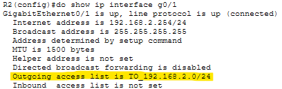

All four interfaces have the correct ACL applied outbound.


**Final ping tests:**

PC1 to PC3 (Numbered ACL 1, 172.16.1.0/24 blocked from 172.16.2.0/24):

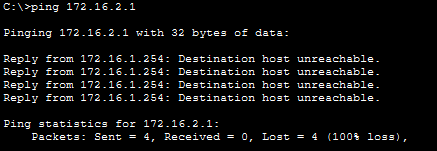

PC4 to PC2 (Numbered ACL 2, 172.16.2.0/24 blocked from 172.16.1.0/24):

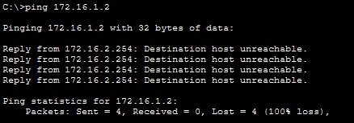

PC1 to SRV1 (TO_192.168.1.0/24, PC1 is permitted):

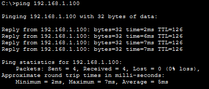

PC2 to SRV1 (TO_192.168.1.0/24, PC2 is not permitted):

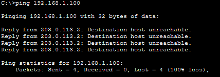

PC3 to SRV2 (TO_192.168.2.0/24, 172.16.2.0/24 is blocked):

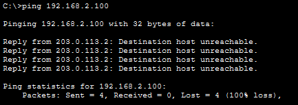

PC1 to SRV2 (TO_192.168.2.0/24, PC1 is not blocked by this ACL):

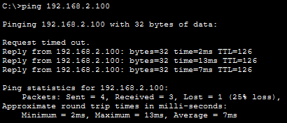

All four ACLs are confirmed to be working correctly.

---

## Verification Summary

| Task | Verified Via |
|------|-------------|
| OSPF adjacency | CLI adjacency message on R2 confirmed LOADING to FULL with R1 |
| OSPF interfaces | `show ip ospf interface brief` on R1 and R2 confirmed all interfaces in area 0 |
| OSPF route sharing | `show ip route` on R1 and R2 confirmed OSPF routes received from each side |
| ACL contents on R1 | `show access-lists` confirmed numbered ACLs 1 and 2 with correct entries |
| ACL contents on R2 | `show access-lists` confirmed named ACLs with correct entries |
| ACL interface assignment | `show ip interface` on all four relevant interfaces confirmed correct outbound ACLs |
| Policy 1 - Only PC1 and PC3 to 192.168.1.0/24 | PC1 ping to SRV1 succeeded, PC2 ping to SRV1 blocked |
| Policy 2 - 172.16.2.0/24 blocked from 192.168.2.0/24 | PC4 ping to SRV2 blocked, PC1 ping to SRV2 succeeded |
| Policy 3 - 172.16.1.0/24 blocked from 172.16.2.0/24 | PC1 ping to PC3 blocked |
| Policy 4 - 172.16.2.0/24 blocked from 172.16.1.0/24 | PC4 ping to PC2 blocked |

---

## Key Concepts Demonstrated

| Concept | Description |
|---------|-------------|
| **Standard ACL** | Filters traffic based on source IP address only, should be placed as close to the destination as possible |
| **Numbered ACL** | Identified by a number, configured entirely from global config mode |
| **Named ACL** | Identified by a descriptive name, uses a dedicated submode after creation, easier to identify when reviewing configs |
| **ACL remark** | A comment attached to a numbered ACL to describe its purpose, visible in the running config |
| **Wildcard Mask** | Used in ACL entries to define the range of addresses to match, a /32 host match can be left blank as the router assumes it as 0.0.0.0 |
| **Implicit Deny** | An invisible deny all entry at the end of every ACL that blocks any traffic not explicitly permitted / denied |
| **permit any** | Required in an ACL where only specific traffic should be denied, to prevent the implicit deny from blocking everything else |
| **ip access-group** | Command used to apply an ACL to an interface in a specified direction (inbound or outbound) |

---

## Reflection

This was the first lab to introduce ACLs, with the most important moment being the typo in the named ACL #2, where `172.168.2.0` was entered instead of `172.16.2.0`. The error was only caught while writing the next policy, which is a realistic reminder of how easy it is to misconfigure an ACL and how important it is to verify entries carefully before applying them. The difference between numbered and named ACLs was also useful to see side by side in the same lab, with named ACLs being noticeably easier to identify and manage.

---

*Lab file: `Day_34_Lab_-_Standard_ACLs.pkt`*	  
*Jeremy's IT Lab - Day 34 | Independent CCNA Study*  
