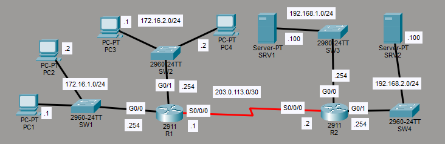
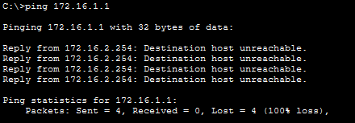
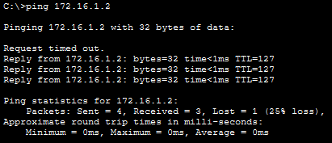
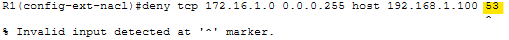
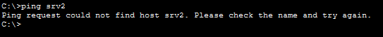
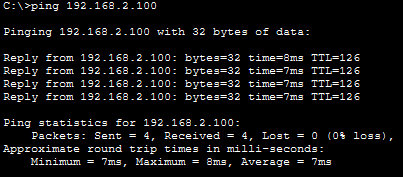
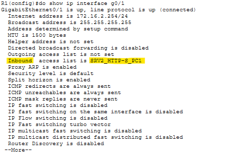
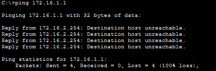
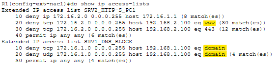

# Lab 35 - Extended ACLs  

**Platform:** Cisco Packet Tracer    
**Source:** Jeremy's IT Lab - Day 35    
**Category:** Network / Security    
**Difficulty:** Intermediate  

---

## Objective

Configure and verify extended named ACLs on R1 to enforce three network policies across a two-router topology. This lab covers named extended ACLs, protocol and port based filtering, wildcard masks for source and destination matching, ACL placement closest to the source, the one ACL per direction per interface limit and verifying ACL behaviour using ping and Packet Tracer's web browser.

---

## Topology Overview



A two-router topology connected via a serial link. R1 acts as the access router for two subnets, with G0/0 facing 172.16.1.0/24 and G0/1 facing 172.16.2.0/24. R2 sits on the other side of the serial link and connects to two server subnets.

| Device | Role |
|--------|------|
| R1     | Access router - G0/0 faces 172.16.1.0/24, G0/1 faces 172.16.2.0/24 |
| R2     | Internal router - connects to server subnets 192.168.1.0/24 and 192.168.2.0/24 |
| PC1    | End host on 172.16.1.0/24 (172.16.1.1) |
| PC2    | End host on 172.16.1.0/24 (172.16.1.2) |
| PC3    | End host on 172.16.2.0/24 |
| PC4    | End host on 172.16.2.0/24 |
| SRV1   | DNS server on 192.168.1.0/24 (192.168.1.100) |
| SRV2   | HTTP/HTTPS server on 192.168.2.0/24 (192.168.2.100) |

---

## Lab Tasks

---

### Task 1 - Configure extended ACLs to fulfill the following network policies:   
- Hosts in 172.16.2.0/24 can't communicate with PC1.   
- Hosts in 172.16.1.0/24 can't access the DNS service on SRV1.   
- Hosts in 172.16.2.0/24 can't access the HTTP or HTTPS services on SRV2.  

Named extended ACLs were used throughout this lab. Named ACLs are more descriptive and easier to manage than numbered ACLs and the extended type allows matching on source address, destination address, protocol and port number. 
Unlike standard ACLs, which are placed closest to the destination, extended ACLs are to be placed closest to the source, as they allow for much more specific rules, meaning traffic can be dropped before it travels unnecessarily across the network.

**Policy 1: Hosts in 172.16.2.0/24 can't communicate with PC1**

The first policy requires blocking all traffic from 172.16.2.0/24 destined for PC1 (172.16.1.1). Traffic from that subnet enters R1 on G0/1, so the ACL was applied inbound there.

```
R1(config)# ip access-list extended TO_PC1
R1(config-ext-nacl)# deny ip 172.16.2.0 0.0.0.255 host 172.16.1.1
R1(config-ext-nacl)# permit ip any any
```

The `ip` keyword is used as the protocol, covering all IP traffic as an umbrella term. The `host` keyword before the destination address can be used to specify a /32 wildcard mask, matching a single host rather than a network range.   
The `permit ip any any` statement counteracts the implicit deny at the end of every ACL, ensuring all other traffic is permitted through.

> For extended ACLs, the sub-config mode is different than for standard ACLs. The prompt reads `config-ext-nacl` for extended named ACLs, as opposed to `config-std-nacl` for standard named ACLs.

```
R1(config)# interface g0/1
R1(config-if)# ip access-group TO_PC1 in
```

A ping from PC3 to PC1 (172.16.1.1) confirmed the block was in effect.



To confirm only PC1 was being filtered and not the entire 172.16.1.0/24 subnet, I did another ping from PC3 to PC2 (172.16.1.2).



PC3 can still reach PC2, confirming the ACL is correctly targeting only PC1.


**Policy 2: Hosts in 172.16.1.0/24 can't access the DNS service on SRV1**

The second policy requires blocking DNS traffic (port 53) from 172.16.1.0/24 to SRV1 (192.168.1.100). Traffic from that subnet enters R1 on G0/0, so the ACL was applied inbound there.

```
R1(config)# ip access-list extended SRV1_DNS_BLOCK
R1(config-ext-nacl)# deny tcp 172.16.1.0 0.0.0.255 host 192.168.1.100 53
```

This was rejected with an error.



The command needs a keyword before the port number, so that it knows specifically what ports to target. The `eq` keyword, meaning "equal to", was missing from the command.   
The correct command is:

```
R1(config-ext-nacl)# deny tcp 172.16.1.0 0.0.0.255 host 192.168.1.100 eq 53
```

Since DNS operates over both TCP and UDP, I entered a second entry to cover both protocols:

```
R1(config-ext-nacl)# deny udp 172.16.1.0 0.0.0.255 host 192.168.1.100 eq 53
R1(config-ext-nacl)# permit ip any any
```

```
R1(config)# interface g0/0
R1(config-if)# ip access-group SRV1_DNS_BLOCK in
```
This applies the ACL to R1's G0/0, set for inbound. This ensures that any traffic destined for SRV1's DNS port (53) will be blocked and filtered here.

> Note: The demonstration video was consulted for the DNS verification method, as I was unfamiliar with how to test DNS in Packet Tracer.

A ping from PC1 using the hostname `srv2` rather than its IP address requires a DNS lookup, which SRV1 handles. With the ACL in place, that lookup should fail.



The hostname resolution failed, confirming DNS traffic is being blocked. To confirm that only DNS was being filtered and not all traffic to SRV2, the same ping was run using SRV2's IP address directly.



The direct IP ping succeeded, confirming only DNS traffic is being dropped.


**Policy 3: Hosts in 172.16.2.0/24 can't access the HTTP or HTTPS services on SRV2**
```
R1(config-if)#ip access-list extended SRV2_HTTP-S
```
To create the ACL

The third policy requires blocking HTTP (port 80) and HTTPS (port 443) from 172.16.2.0/24 to SRV2 (192.168.2.100). 
As I started to configure this ACL, I realised that traffic from that subnet enters R1 on G0/1, the same interface TO_PC1 was already applied to inbound. Only one ACL can be active per direction per interface, so the two ACLs need to be merged into one.

The SRV2_HTTP-S ACL was deleted before it was applied and a combined replacement was created. The existing TO_PC1 ACL was kept active on G0/1 while the replacement was being configured, to avoid a potential window where blocked traffic could pass through unfiltered. In this practice lab that poses no threat but in an actual network it definitely could.

```
R1(config)# ip access-list extended SRV2_HTTP-S_PC1
R1(config-ext-nacl)# deny ip 172.16.2.0 0.0.0.255 host 172.16.1.1
R1(config-ext-nacl)# deny tcp 172.16.2.0 0.0.0.255 host 192.168.2.100 eq 80
R1(config-ext-nacl)# deny tcp 172.16.2.0 0.0.0.255 host 192.168.2.100 eq 443
R1(config-ext-nacl)# permit ip any any
```

The first entry carries over the PC1 block from the original ACL (TO_PC1). The next two entries deny TCP traffic to SRV2 on ports 80 and 443, covering HTTP and HTTPS respectively.

```
R1(config)# interface g0/1
R1(config-if)# ip access-group SRV2_HTTP-S_PC1 in
```

Applying the new ACL to G0/1 inbound should automatically replace the old TO_PC1 ACL, since only one per direction per interface is permitted. The `show ip interface g0/1` command was used to confirm the correct ACL was now active.



> Note: The demonstration video was also consulted for the HTTP and HTTPS verification method, as I was unfamiliar in testing web traffic on Packet Tracer.

HTTP and HTTPS access were both tested from PC3 using Packet Tracer's web browser.


Both timed out, confirming the deny entries for ports 80 and 443 are working as intended.   
The PC1 block was re-verified using PC4 to ensure the merged ACL still enforced that policy correctly.



The block remained in effect.   
Finally, `show ip access-lists` was run to review all active ACL entries and confirm match counts across both lists.



All entries seem to be correct.
Worth noting that it seems the router displays certain port numbers with names rather than numbers. Port 80 (HTTP) appears as `www` and port 53 (DNS) appears as `domain`.

---

## Verification Summary

| Task | Verified Via |
|------|-------------|
| Policy 1 - PC1 block | PC3 ping to 172.16.1.1 returned Destination host unreachable; ping to 172.16.1.2 successful, confirming only PC1 filtered |
| Policy 2 - DNS block | PC1 ping to `srv2` by hostname failed, ping to 192.168.2.100 by IP successful, confirming only DNS filtered |
| Policy 3 - HTTP/HTTPS block | Packet Tracer web browser returned Request Timeout for both http://cisco.com and https://cisco.com on PC3 |
| ACL merge and application | `show ip interface g0/1` confirmed SRV2_HTTP-S_PC1 active inbound |
| PC1 block post-merge | PC4 ping to 172.16.1.1 confirmed policy still enforced after ACL replacement |
| All ACL entries | `show ip access-lists` confirmed all deny entries with match counts on both ACLs |

---

## Key Concepts Demonstrated

| Concept | Description |
|---------|-------------|
| **Extended ACL** | Filters traffic based on source IP, destination IP, protocol and port, providing more granular control than standard ACLs |
| **Named ACL** | Uses a descriptive name instead of a number, making ACLs easier to identify and manage |
| **ACL Placement** | Extended ACLs are placed closest to the source whereas standard ACLs are placed closest to the destination |
| **One ACL per Direction per Interface** | Only one inbound and one outbound ACL can be applied to an interface at a time |
| **Protocol Matching** | `ip` covers all IP traffic, `tcp` and `udp` target specific transport protocols |
| **Port Matching with eq** | The `eq` (equal to) keyword filters traffic matching a specific port number |
| **host Keyword** | Specifies a /32 wildcard mask for the following address, used to match a single host |
| **Implicit Deny** | All ACLs end with an implicit deny all, `permit ip any any` is required to allow unmatched traffic through |

---

## Reflection

The biggest issue I faced in this lab came during Policy 3, when it became clear that two separate policies both required an inbound ACL on G0/1. As only one ACL can be active per direction per interface, the initial TO_PC1 ACL had to be merged into a new ACL, alongside the SRV2 HTTP/HTTPS rules. It didn't cause too much of an issue, however I should have viewed all the steps of the lab first and made a plan, rather than just working my way down the list of requirements. The DNS verification approach was also new, using a hostname based ping to force a DNS lookup rather than testing the destination service directly.

---

*Lab file: `Day_35_Lab_-_Extended_ACLs.pkt`*	  
*Jeremy's IT Lab - Day 35 | Independent CCNA Study*  
