# Lab 36 - CDP and LLDP  

**Platform:** Cisco Packet Tracer    
**Source:** Jeremy's IT Lab - Day 36    
**Category:** Network / Management    
**Difficulty:** Foundational  

---

## Objective

Use CDP (Cisco Discovery Protocol) commands to identify and document missing IP addresses and interface IDs across a three-router, three-switch topology, then transition the network from CDP to LLDP. This lab covers CDP discovery methods for PCs and switches, disabling CDP per-interface and globally and enabling LLDP globally with Tx/Rx configured on individual interfaces.

---

## Topology Overview

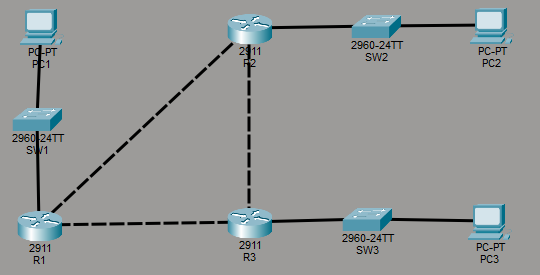

A three-router, three-switch topology with one PC per switch. The topology began with device labels only, with all IP addresses and interface IDs absent. The complete addressing and interface information was discovered through CDP and supporting commands in Task 1.

| Device | Role |
|--------|------|
| R1     | Internal router connecting 192.168.1.0/24 to R2 and R3 |
| R2     | Internal router connecting 192.168.2.0/24 to R1 and R3 |
| R3     | Internal router connecting 192.168.3.0/24 to R1 and R2 |
| SW1    | Access switch for 192.168.1.0/24 |
| SW2    | Access switch for 192.168.2.0/24 |
| SW3    | Access switch for 192.168.3.0/24 |
| PC1    | End host on 192.168.1.0/24 (192.168.1.1) |
| PC2    | End host on 192.168.2.0/24 (192.168.2.1) |
| PC3    | End host on 192.168.3.0/24 (192.168.3.1) |

---

## Lab Tasks

---

### Task 1 - Use CDP (and other commands) to identify and label the missing IP addresses and interface IDs of the devices in the network.

CDP is enabled by default on all Cisco devices and required no manual setup. The primary command used on each router was `show cdp neighbors detail`, which provides each neighbour's IP address (if applicable), the local interface the connection uses and the port ID, which is the interface on the neighbouring device.

R1's output covered three neighbours across two screenshots. SW1 appeared without an IP address, as switches do not have IP addresses assigned, but its interface information was still recorded.   
R2 appeared with an IP address of 10.0.12.2, connected via R1's G0/1 to R2's G0/0.   
R3 appeared with an IP address of 10.0.13.2, connected via R1's G0/0 to R3's G0/1.

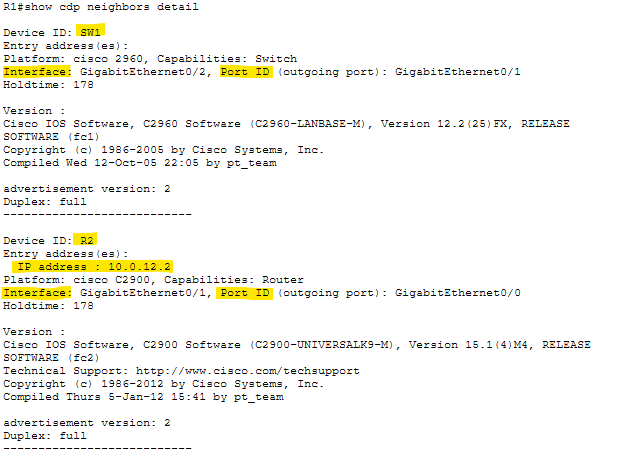

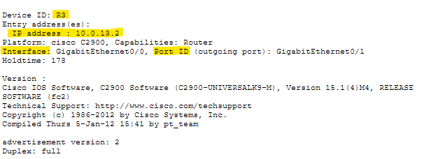

R2's output confirmed the details gathered about that device from R1's table and filled in the remaining connections.  
R3 appeared with an IP address of 10.0.23.2, connected via R2's G0/2 to R3's G0/2.   
R1 appeared with an IP address of 10.0.12.1, connected via R2's G0/0 to R1's G0/1.   
SW2 appeared without an IP, connected via R2's G0/1 to SW2's G0/2.

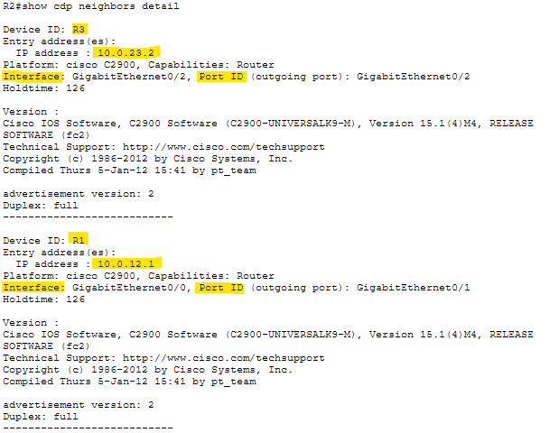

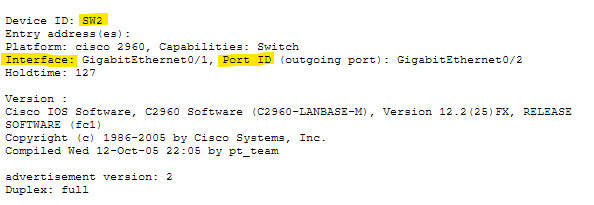

R3's output completed the router picture.   
SW3 appeared without an IP, connected via R3's G0/0 to SW3's G0/1.   
R1 appeared with an IP address of 10.0.13.1, connected via R3's G0/1 to R1's G0/0.   
R2 appeared with an IP address of 10.0.23.1, connected via R3's G0/2 to R2's G0/2.

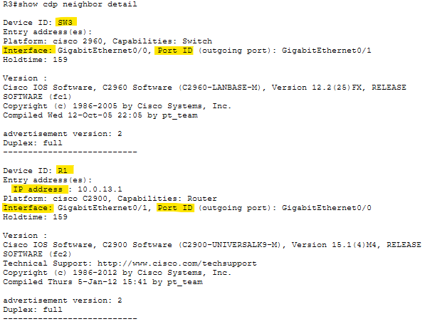

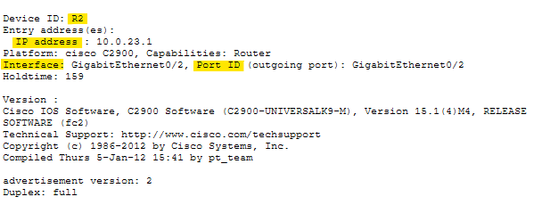

SW1's CDP neighbor table was checked next.   
The only entry was R1, which appeared with an IP address of 192.168.1.254, confirming R1's G0/2 connects to SW1's G0/1 and R1 as the default gateway for the 192.168.1.0/24 subnet.

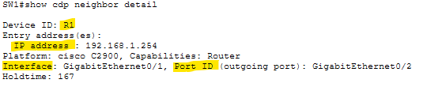

At this point I realised that checking SW2 and SW3's CDP tables was unnecessary. CDP cannot see PCs, so the switch tables would only confirm information about the routers already discovered. PC information needed to come from the PCs directly via `ipconfig`, and the specific switch port each PC connected to was found using `show interfaces status` on it's respective switch.

PC1's `ipconfig` confirmed its IP address as 192.168.1.1 with a default gateway of 192.168.1.254, matching R1's address on that subnet.

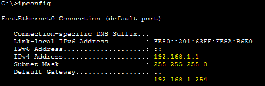

SW1's `show interfaces status` showed only two connected ports: Fa0/10 and G0/1. Since R1 is already confirmed on G0/1, PC1 must be connected on Fa0/10.

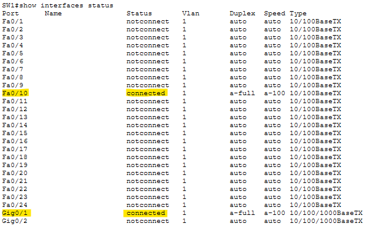

The same process was repeated for the remaining PC and switch pairs.   
PC2's `ipconfig` confirmed its IP as 192.168.2.1 with a gateway of 192.168.2.254. SW2's active ports were Fa0/1 and G0/2. Since R2 connects on G0/2, PC2 is on Fa0/1.

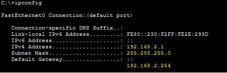

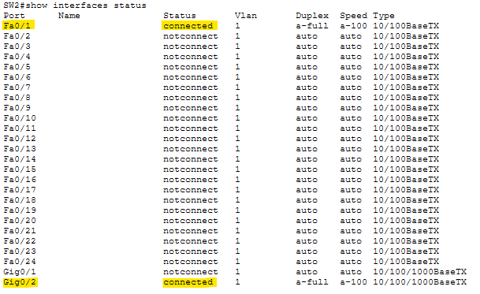

PC3's `ipconfig` confirmed its IP as 192.168.3.1 with a gateway of 192.168.3.254. SW3's active ports were Fa0/24 and G0/1. Since R3 connects on G0/1, PC3 is on Fa0/24.

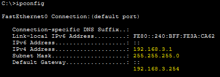

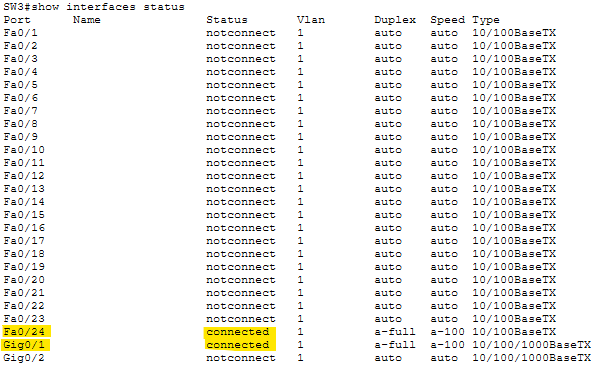


With all addressing and interface information gathered, the topology was fully labelled.

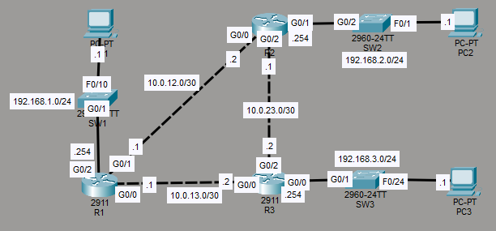

---

### Task 2 - Disable CDP on the switch interfaces currently connected to PCs.

CDP can be disabled per-interface using `no cdp enable` in interface configuration mode.

```
SW1(config)# int fa0/10
SW1(config-if)# no cdp enable

SW2(config)# int fa0/1
SW2(config-if)# no cdp enable

SW3(config)# int fa0/24
SW3(config-if)# no cdp enable
```

---

### Task 3 - Disable CDP globally on each network device.

CDP is disabled globally using `no cdp run` in global configuration mode. This was applied to all six network devices.

```
SW1(config)# no cdp run
SW2(config)# no cdp run
SW3(config)# no cdp run
R1(config)# no cdp run
R2(config)# no cdp run
R3(config)# no cdp run
```

---

### Task 4 - Enable LLDP globally on each network device, and enable Tx/Rx on the interfaces connected to other network devices.

LLDP (Link Layer Discovery Protocol) is the industry standard equivalent of CDP. Unlike CDP, it is not exclusive to Cisco devices and can function across multiple vendor devices.

LLDP is enabled globally using `lldp run` in global configuration mode, applied to all six network devices:

```
SW1(config)# lldp run
SW2(config)# lldp run
SW3(config)# lldp run
R1(config)# lldp run
R2(config)# lldp run
R3(config)# lldp run
```

Unlike CDP, which activates on all interfaces once enabled globally, LLDP requires transmission and receiving to be enabled individually on each interface using `lldp transmit` and `lldp receive`.   
These were only applied to interfaces connected to other network devices, not to interfaces facing PCs.

Each switch had a single interface to configure:

```
SW1(config)# int g0/1
SW1(config-if)# lldp transmit
SW1(config-if)# lldp receive

SW2(config)# int g0/2
SW2(config-if)# lldp transmit
SW2(config-if)# lldp receive

SW3(config)# int g0/1
SW3(config-if)# lldp transmit
SW3(config-if)# lldp receive
```

Each router had three interfaces to configure.   
The `interface range` command was used to apply both commands across all three interfaces at once, avoiding the need to repeat the process per interface:

```
R1(config)# int range g0/0-2
R1(config-if-range)# lldp transmit
R1(config-if-range)# lldp receive

R2(config)# int range g0/0-2
R2(config-if-range)# lldp transmit
R2(config-if-range)# lldp receive

R3(config)# int range g0/0-2
R3(config-if-range)# lldp transmit
R3(config-if-range)# lldp receive
```

**Verification:**

Packet Tracer's simulation mode was used to confirm CDP was no longer present and LLDP was functioning. Filters were set to display both CDP and LLDP traffic, so any CDP frames would be visible alongside LLDP if still accidentally enabled..

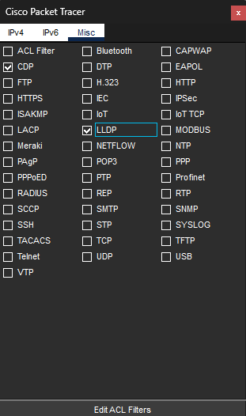

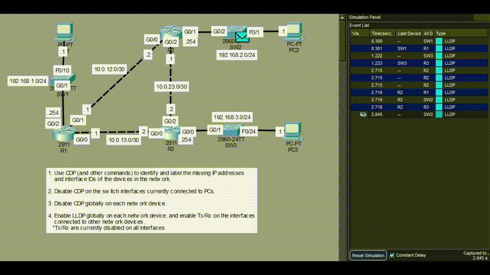

Only LLDP traffic appeared in the event list. CDP produced no frames, confirming it is fully disabled. All devices were seen both transmitting and receiving LLDP, confirming the configuration is working correctly across the topology.

---

## Verification Summary

| Task | Verified Via |
|------|-------------|
| Router IP addresses and interface IDs | `show cdp neighbors detail` on R1, R2 and R3, cross-referenced across all three outputs |
| Switch-to-router interface IDs | CDP output on each router and confirmed via SW1's CDP neighbor table |
| PC IP addresses | `ipconfig` on PC1, PC2 and PC3 |
| PC switch interfaces | `show interfaces status` on SW1, SW2 and SW3, connected ports isolated by elimination |
| Completed topology | Packet Tracer topology diagram fully labelled after discovery |
| CDP disabled | No CDP frames present in simulation mode with CDP filter active |
| LLDP operation | Simulation mode event list confirmed LLDP transmitting and receiving on all configured devices |

---

## Key Concepts Demonstrated

| Concept | Description |
|---------|-------------|
| **CDP** | Cisco Discovery Protocol, a Cisco proprietary protocol that advertises device information to directly connected neighbours |
| **show cdp neighbors detail** | Displays detailed CDP neighbour information including IP address, local interface and port ID |
| **CDP on PCs** | CDP does not run on end hosts, needing `ipconfig` and `show interfaces status` to get the information |
| **show interfaces status** | Displays the connection status of all switch interfaces, used here to identify which ports have active connections |
| **no cdp enable** | Disables CDP on a specific interface without affecting the global CDP process |
| **no cdp run** | Disables CDP globally on a device |
| **LLDP** | Link Layer Discovery Protocol, an industry standard discovery protocol supported across multiple vendor devices |
| **lldp run** | Enables LLDP globally on a device |
| **lldp transmit / lldp receive** | Enables LLDP transmission and receiving on the specified interface, needs to be applied separately from the global LLDP enable |

---

## Reflection

Task 1 was the most time consuming part of the lab, building a complete picture of the topology by working through each router's CDP output in sequence and cross-referencing entries across devices to verify. The key insight was recognising that checking SW2 and SW3's CDP tables would have added nothing other than what the router outputs already output and that `ipconfig` combined with `show interfaces status` was the more direct way to get the remaining PC and switch information. Task 4 also highlighted a difference between CDP and LLDP: where CDP activates on all interfaces automatically once enabled globally, LLDP requires explicit Tx and Rx configuration per interface, which gives more control but also more manual configuration.

---

*Lab file: `Day_36_Lab_-_CDP___LLDP.pkt`*	  
*Jeremy's IT Lab - Day 36 | Independent CCNA Study*  
